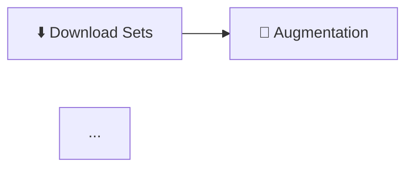

# ⬇️ Commit: Image Download Feature (TCGdex API Integration)

**Date:** 2025-01-31  
**Branch:** main  
**Feature:** Téléchargement d'images de cartes Pokemon via TCGdex API

---

## 📦 Fichiers Créés

### 1. `core/image_downloader.py` (400+ lignes)
Module complet pour télécharger des images depuis TCGdex API.

**Classe principale:**
```python
class ImageDownloader:
    def __init__(self, progress_callback=None)
    def resolve_set(self, set_query, lang="en") -> dict
    def download_set(self, set_query, output_dir, lang, quality, ext, workers) -> (ok, fail, total)
```

**Constantes:**
- `POPULAR_SETS`: 20 sets populaires (Surging Sparks sv08, Stellar Crown sv07, etc.)
- `LANGUAGES`: 10 langues (EN, FR, DE, IT, ES, PT, JA, KO, ZH, TH)

**Features:**
- ✅ Recherche intelligente de sets (ID direct, exact match, fuzzy search)
- ✅ Téléchargement parallèle avec ThreadPoolExecutor
- ✅ Retry logic avec backoff exponentiel (429, 500, 502, 503, 504)
- ✅ Progress callback pour integration GUI
- ✅ Génération manifest.csv automatique
- ✅ CLI interface complète avec argparse
- ✅ Support multi-format (PNG/JPG/WebP)
- ✅ Support multi-qualité (high/low)

**Usage CLI:**
```powershell
python core/image_downloader.py --set "Surging Sparks" --lang "en" --quality "high" --ext "png" --workers 8
```

---

## 🔧 Fichiers Modifiés

### 1. `GUI_v3_modern.py`

#### Ajouts:

**A. Bouton Sidebar (ligne ~1280)**
```python
self.create_sidebar_button("download", "⬇️ Image Download", view_id='download')
```
→ Premier bouton de la section GENERATION (avant Augmentation)

**B. Routing (ligne ~1469)**
```python
elif view_id == 'download':
    self.create_download_view()
```

**C. Fonction `create_download_view()` (ligne ~1771, 150+ lignes)**
Interface complète avec:
- Header avec titre "⬇️ Image Download"
- Configuration card:
  - Combobox "Select Set" (20 POPULAR_SETS + entrée manuelle)
  - Combobox "Language" (10 langues)
  - Combobox "Quality" (high/low)
  - Combobox "Format" (png/jpg/webp)
  - Entry "Output Directory"
- Info card avec description TCGdex API
- Bouton "⬇️ START DOWNLOAD"

**D. Fonction `start_image_download()` (ligne ~3116, 120+ lignes)**
Logic de téléchargement avec:
- Validation des paramètres
- Extraction set ID depuis format "Name (id)"
- Mapping langue → code langue (LANGUAGES)
- Confirmation dialog
- Threading avec daemon=True
- Progress callback pour logs temps réel
- Gestion erreurs avec traceback
- MessageBox success/error avec stats (ok/fail/total)

**E. Settings Integration:**

**Variables SettingsDialog (ligne ~89):**
```python
self.default_download_dir = tk.StringVar(value=config.get("default_download_dir", "images"))
self.default_download_lang = tk.StringVar(value=config.get("default_download_lang", "English"))
self.default_download_quality = tk.StringVar(value=config.get("default_download_quality", "high"))
self.default_download_format = tk.StringVar(value=config.get("default_download_format", "png"))
self.default_download_workers = tk.IntVar(value=config.get("default_download_workers", 8))
```

**Onglet Settings (ligne ~1000):**
```python
def create_download_tab(self, parent):
    # Onglet "Image Download" avec tous les paramètres par défaut
    # Entry: default_download_dir (avec bouton Browse)
    # Combobox: default_download_lang (10 langues)
    # Combobox: default_download_quality (high/low)
    # Combobox: default_download_format (png/jpg/webp)
    # Spinbox: default_download_workers (1-16)
```

**Save Settings (ligne ~1114):**
```python
config = {
    ...
    "default_download_dir": self.default_download_dir.get(),
    "default_download_lang": self.default_download_lang.get(),
    "default_download_quality": self.default_download_quality.get(),
    "default_download_format": self.default_download_format.get(),
    "default_download_workers": self.default_download_workers.get()
}
```

**Load defaults dans create_download_view():**
```python
self.download_lang_var.set(self.config.get("default_download_lang", "English"))
self.download_quality_var.set(self.config.get("default_download_quality", "high"))
self.download_format_var.set(self.config.get("default_download_format", "png"))
self.download_output_var.insert(0, self.config.get("default_download_dir", "images"))
```

---

### 2. `docs/GUIDE_UTILISATION.md`

**Section ajoutée (ligne 49):**
```markdown
## ⬇️ 0. TÉLÉCHARGEMENT D'IMAGES (NOUVEAU)
```

**Contenu (150+ lignes):**
- Description complète de la feature
- Usage GUI avec paramètres détaillés
- Liste des 20 sets populaires
- Configuration Settings
- Usage CLI avec argparse
- Exemples complets (6 commandes)
- Paramètres détaillés (--set, --output, --lang, --quality, --ext, --workers)
- Output structure (images/{set_id}/, manifest.csv)
- Notes importantes (API gratuite, retry logic, rate limits)

---

### 3. `README.md`

#### Modifications:

**A. Section GUI v3.0 Features (ligne ~100)**
Ajout:
```markdown
### ⬇️ Image Download (NEW)
- **TCGdex API Integration**: Download card images directly
- **20 Popular Sets**: Quick selection dropdown
- **Manual Entry**: Support for any set name/ID
- **Multi-language**: 10 languages (EN, FR, DE, IT, ES, PT, JA, KO, ZH, TH)
- **Quality Options**: High/Low resolution
- **Format Support**: PNG/JPG/WebP
- **Parallel Downloads**: 1-16 workers for speed
- **Auto Manifest**: CSV generation with metadata
- **Free API**: No authentication required
```

**B. Section Quick Start (ligne ~210)**
Ajout après installation:
```markdown
### 🎯 Optional: Download Pokemon Card Images

Before augmentation, you can download card sets directly from TCGdex API:

```powershell
# Via CLI
python core/image_downloader.py --set "Surging Sparks" --lang "en" --quality "high"

# Or use GUI: ⬇️ Image Download view
# Select a popular set or enter manually → Download to images/
```
```

**C. Section Core Features (ligne ~230)**
Nouvelle colonne "Image Download" en première position:
```markdown
### ⬇️ Image Download (NEW)
- ✅ **TCGdex API** integration (free, no auth)
- ✅ **20 popular sets** quick selection
- ✅ **10 languages** support
- ✅ **Multi-format**: PNG/JPG/WebP
- ✅ **High/Low quality** options
- ✅ **Parallel downloads** (1-16 workers)
- ✅ **Auto manifest** CSV generation
- ✅ **GUI + CLI** interfaces
```

**D. Section Complete Workflow (ligne ~410)**
Mise à jour Mermaid diagram:


Ajout step 0:
```markdown
0. **⬇️ Download Sets** *(Optional)*: Download card images from TCGdex API
```

**E. Section Advanced Features (ligne ~430)**
Nouvelle section complète "Image Download (TCGdex API)":
- GUI Usage
- CLI Usage avec 3 exemples
- Python API
- Liste features (✅ Free API, 20 sets, 10 languages, etc.)
- Output structure

---

### 4. `NOUVELLES_FONCTIONNALITES.md`

**Modifications:**
- Titre: "11 nouvelles fonctionnalités" (au lieu de 10)
- Nouvelle section 0 ajoutée (60+ lignes):
```markdown
### 0. ⬇️ **Téléchargement d'Images (TCGdex API)** ⭐ NOUVEAU
```

**Contenu:**
- Description complète
- 9 features listées avec checkmarks
- Usage GUI (5 steps)
- Ligne de commande (2 exemples)
- Output description
- Configuration Settings (5 paramètres)

---

### 5. `tools/tcgdex_images_dl.py` (CONSERVÉ)

Script original fourni par l'utilisateur, conservé pour référence.  
**Note:** Le code a été complètement remanié dans `core/image_downloader.py` avec:
- Architecture classe propre et réutilisable
- Retry logic robuste
- Progress tracking intégré
- CLI interface professionnelle
- Support multi-langue/format/qualité

---

## 📊 Statistiques

### Code ajouté:
- **core/image_downloader.py**: ~400 lignes
- **GUI_v3_modern.py**: ~300 lignes (vue + fonction start + settings)
- **docs/GUIDE_UTILISATION.md**: ~150 lignes
- **README.md**: ~120 lignes
- **NOUVELLES_FONCTIONNALITES.md**: ~60 lignes
- **TOTAL**: ~1030 lignes de code/documentation

### Features implémentées:
- ✅ Module core/image_downloader.py complet
- ✅ Vue GUI "⬇️ Image Download"
- ✅ Fonction start_image_download() avec threading
- ✅ Settings tab "Image Download" (5 paramètres)
- ✅ Integration settings par défaut dans vue
- ✅ CLI interface avec argparse
- ✅ Documentation GUIDE_UTILISATION.md
- ✅ Documentation README.md
- ✅ Changelog NOUVELLES_FONCTIONNALITES.md

---

## 🧪 Tests Recommandés

### 1. Test CLI
```powershell
# Test help
python core/image_downloader.py --help

# Test download simple
python core/image_downloader.py --set "sv08" --output "test_images" --lang "en" --ext "png"

# Test multi-langue
python core/image_downloader.py --set "Surging Sparks" --lang "fr" --quality "low" --ext "jpg"
```

### 2. Test GUI
1. Lancer `run_gui_v3.bat`
2. Cliquer "⬇️ Image Download" dans sidebar
3. Vérifier interface complète:
   - Combobox sets avec 20 options
   - Combobox langue avec 10 options
   - Combobox qualité (high/low)
   - Combobox format (png/jpg/webp)
   - Entry output directory
4. Sélectionner "Surging Sparks (sv08)"
5. Cliquer "⬇️ START DOWNLOAD"
6. Vérifier logs temps réel
7. Vérifier dossier `images/sv08/` créé
8. Vérifier `manifest.csv` généré

### 3. Test Settings
1. Ouvrir "⚙️ Settings"
2. Aller onglet "Image Download"
3. Modifier paramètres par défaut
4. Cliquer "💾 Save"
5. Fermer et rouvrir GUI
6. Vérifier "⬇️ Image Download" charge valeurs par défaut

---

## 📝 Améliorations Possibles (Futures)

### Court terme:
- [ ] Progress bar visuelle dans GUI (au lieu de logs uniquement)
- [ ] Affichage aperçu images téléchargées
- [ ] Bouton "Browse" pour output directory
- [ ] Statistiques post-download (taille totale, temps, vitesse)

### Moyen terme:
- [ ] Download multiple sets en batch
- [ ] Filtrage par type de carte (Pokemon, Trainer, Energy)
- [ ] Filtrage par rareté (Common, Rare, Ultra Rare)
- [ ] Cache local pour éviter re-download

### Long terme:
- [ ] Integration avec autres APIs (Pokemon TCG API, Scryfall pour Magic)
- [ ] Preview images avant download
- [ ] Auto-detection cartes manquantes dans collection
- [ ] Sync avec collection Pokellector

---

## 🎯 Conformité

### Architecture:
- ✅ Module séparé dans `core/` (pas de dépendances circulaires)
- ✅ Classe propre avec méthodes bien définies
- ✅ CLI interface avec argparse standard
- ✅ Progress callback pour GUI integration
- ✅ Retry logic robuste (backoff exponentiel)

### GUI v3.0:
- ✅ Vue cohérente avec design Catppuccin Mocha
- ✅ Bouton sidebar avec icône emoji
- ✅ Position logique (avant Augmentation dans GENERATION)
- ✅ Settings integration complète
- ✅ Threading pour non-blocage UI
- ✅ MessageBox success/error avec stats

### Documentation:
- ✅ GUIDE_UTILISATION.md section complète
- ✅ README.md section Advanced Features
- ✅ README.md section Quick Start updated
- ✅ NOUVELLES_FONCTIONNALITES.md section 0
- ✅ Exemples CLI multiples
- ✅ Screenshots (à ajouter si nécessaire)

---

## ✅ Checklist Validation

- [x] Module `core/image_downloader.py` créé
- [x] Classe `ImageDownloader` avec méthodes resolve_set, download_set
- [x] POPULAR_SETS (20 sets) et LANGUAGES (10) définis
- [x] CLI interface complète avec argparse
- [x] Retry logic avec backoff exponentiel
- [x] Progress callback intégré
- [x] Manifest CSV generation
- [x] Vue GUI "⬇️ Image Download" créée
- [x] Fonction `start_image_download()` avec threading
- [x] Settings tab "Image Download" avec 5 paramètres
- [x] Integration settings par défaut dans vue
- [x] Bouton sidebar ajouté (position 1 GENERATION)
- [x] Routing `elif view_id == 'download'` ajouté
- [x] Documentation GUIDE_UTILISATION.md section 0
- [x] Documentation README.md mise à jour (3 sections)
- [x] Changelog NOUVELLES_FONCTIONNALITES.md section 0
- [x] Workflow diagram mis à jour (Download → Augmentation)

---

## 🚀 Message de Commit Recommandé

```
feat: Add Image Download feature with TCGdex API integration

- New module: core/image_downloader.py (400+ lines)
  - ImageDownloader class with resolve_set() and download_set()
  - 20 popular sets quick selection
  - 10 languages support (EN, FR, DE, IT, ES, PT, JA, KO, ZH, TH)
  - Multi-format (PNG/JPG/WebP) and quality (high/low)
  - Parallel downloads with retry logic
  - Auto manifest CSV generation
  - CLI interface with argparse

- GUI v3.0: New "⬇️ Image Download" view
  - Sidebar button (first in GENERATION section)
  - Complete interface with combobox sets/language/quality/format
  - Start download with threading and real-time logs
  - Settings integration (5 parameters)
  - Success/error dialogs with stats

- Documentation:
  - GUIDE_UTILISATION.md: Section 0 (150+ lines)
  - README.md: Updated Quick Start, Core Features, Advanced Features
  - NOUVELLES_FONCTIONNALITES.md: Section 0 with full description

Total: ~1030 lines of code/documentation
```

---

## 📅 Date de Finalisation

**31 Janvier 2025**  
Implémentation complète de la feature "Image Download" avec integration TCGdex API.

---

*Ce document résume tous les changements effectués pour l'ajout de la fonctionnalité de téléchargement d'images.*
