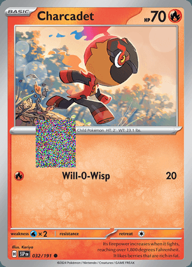
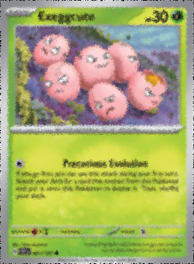
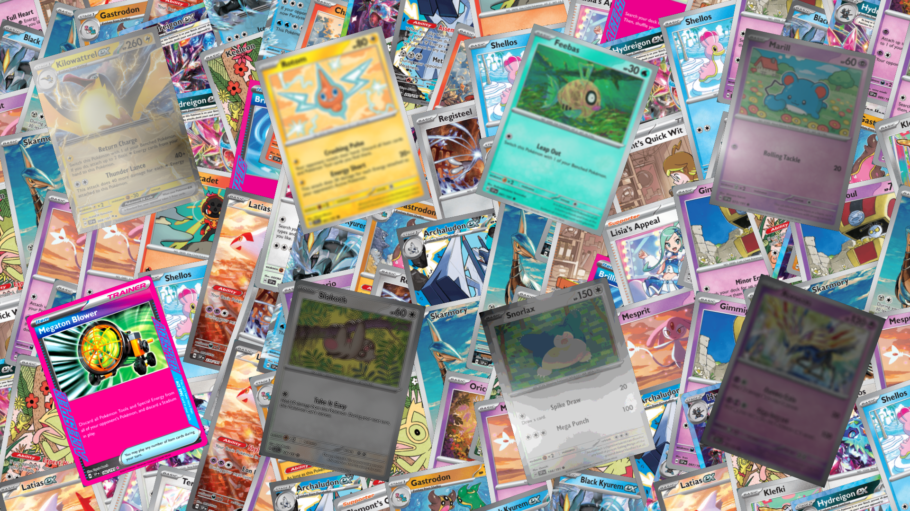
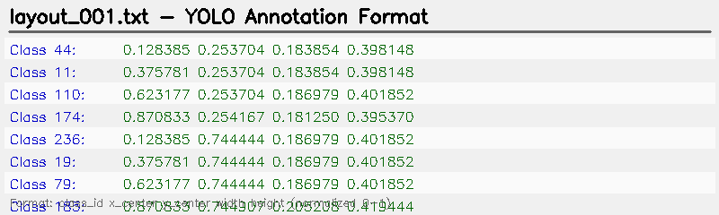
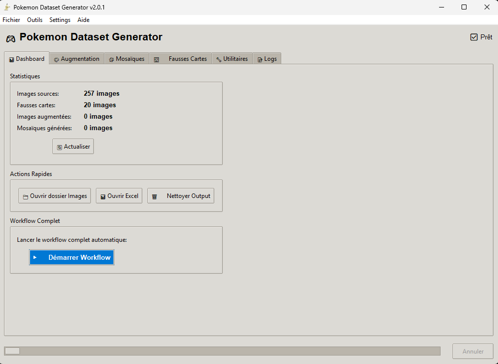

<div align="center">


# 🎮 Pokémon Dataset Generator

[](https://www.python.org/downloads/)
[](https://opensource.org/licenses/MIT)
[](https://opencv.org/)
[](https://github.com/aleju/imgaug)

**Automatic YOLO training dataset generator for Pokémon cards**

*Advanced augmentation • Annotated mosaics • Complete pipeline*

---

[🇫🇷 Version Française](README_FR.md)

</div>

## 🖼️ Generation Examples

<div align="center">

### 📸 Complete Workflow

</div>

<table>
<tr>
<td align="center" width="25%">

<br/>
<strong>① Fake Background</strong>
<br/>
<sub>Random Erasing + Augmentation</sub>
</td>
<td align="center" width="25%">

<br/>
<strong>② Augmented Card</strong>
<br/>
<sub>22 possible transformations</sub>
</td>
<td align="center" width="25%">

<br/>
<strong>③ YOLO Layout</strong>
<br/>
<sub>8-card mosaic</sub>
</td>
<td align="center" width="25%">

<br/>
<strong>④ Bounding Boxes</strong>
<br/>
<sub>Visualized annotations</sub>
</td>
</tr>
</table>

<div align="center">

### 📝 YOLO Annotation Format



<sub>Format: `class_id x_center y_center width height` (normalized 0-1)</sub>

---

</div>

## 📋 Table of Contents

<div align="center">

| Section | Description |
|---------|-------------|
| [✨ Features](#-features) | Complete feature list |
| [🚀 Installation](#-installation) | Quick installation guide |
| [📖 Usage](#-usage) | How to use the generator |
| [📁 Structure](#-project-structure) | File organization |
| [🖥️ GUI v2.0](#️-gui-v20) | Modern graphical interface |
| [🔄 Workflow](#-workflow) | Generation pipeline |
| [📚 Documentation](#-documentation) | Guides and documentation |

</div>

---

## ✨ Features

<table>
<tr>
<td width="33%" valign="top">

### 🎨 Image Augmentation
- ✅ **22 transformation types**
- ✅ **2-5 transformations** per image
- ✅ **~35,420 possible combinations**
- ✅ **PNG with alpha** support (RGBA)
- ✅ Automatic **YOLO** annotations
- ✅ Unique random seed
- 🎯 **Effects**: Blur, contrast, saturation, fog, posterize, sharpen, emboss, noise, JPEG compression, color temperature

</td>
<td width="33%" valign="top">

### 🧩 Mosaic Generation
- ✅ **3 layout modes**: Grid, Rotation, Random
- ✅ **3 background modes**: Mosaic, Local, Web
- ✅ **2 transformation modes**: 2D, 3D Perspective
- ✅ **252 cards** with unique IDs
- ✅ **YOLO** 4-point polygon annotations
- ✅ **YOLOv8** compatible format
- 🎯 **Output**: 65 layouts by default

</td>
<td width="33%" valign="top">

### 🖼️ Fake Cards
- ✅ Configurable **Random Erasing**
- ✅ Probability **0.0 - 1.0**
- ✅ Automatic workflow
- ✅ Used as mosaic **backgrounds**
- 🔄 **Pipeline**: images → Random Erasing → fakeimg → Augmentation → fakeimg_augmented

</td>
</tr>
<tr>
<td colspan="3" align="center">

### 🖥️ Graphical Interface v2.0

**Dashboard** • **Automatic validation** • **Progress bar** • **Multi-threading** • **Persistent configuration**

</td>
</tr>
</table>

---

## 🚀 Installation

<table>
<tr>
<td width="50%" valign="top">

### 📋 Prerequisites

| Item | Version | Status |
|------|---------|--------|
| **Python** | 3.12+ | ✅ Recommended |
| **OS** | Windows 10/11 | ✅ Batch scripts |
| **Git** | Latest | ⚠️ Optional |
| **Disk space** | ~2 GB | For env + datasets |

</td>
<td width="50%" valign="top">

### ⚡ Quick Install

```batch
# 1️⃣ Clone the repository
git clone https://github.com/lo26lo/pok.git
cd pok/Pokemons

# 2️⃣ Automatic installation
install_env.bat
```

**✨ The installer configures everything automatically!**

</td>
</tr>
</table>

<details>
<summary>📦 <b>What does install_env.bat do?</b></summary>

<br/>

```
1. 🔍 Detects Python 3.12 (or installs if missing)
2. 📦 Creates virtual environment .venv
3. ⬇️  Installs all dependencies:
   - opencv-python (image processing)
   - pandas (Excel manipulation)
   - imgaug (augmentation)
   - numpy < 2.0 (compatibility)
   - pillow, requests, scipy, scikit-image
4. ✅ Verifies installation
5. 🎉 Ready to use!
```

</details>

<details>
<summary>🛠️ <b>Manual Installation</b></summary>

<br/>

```batch
# Create virtual environment
python -m venv .venv

# Activate
.venv\Scripts\activate

# Install dependencies
pip install -r requirements.txt
```

</details>

<details>
<summary>🔑 <b>API Configuration (Optional)</b></summary>

<br/>

For API features (card list generation, price updates):

```batch
# 1. Copy the example file
copy api_config.json.example api_config.json

# 2. Choose your API source in api_config.json
```

**🆕 NEW:** 3 API sources available!

| API Source | Region | Authentication | Speed | Cost |
|------------|--------|---------------|-------|------|
| **TCGdex** ⭐ | 🌍 Global | ❌ None | ⚡ Ultra-fast | 💰 FREE |
| **Pokemon TCG** | 🇺🇸 USA | ✅ API Key | 🐌 Medium | 💰 FREE |
| **Cardmarket** | 🇪🇺 Europe | ✅ OAuth 1.0 | 🐌 Slow | 💰 FREE |

**⭐ Recommended: TCGdex** (no setup, combines Cardmarket + TCGPlayer prices)

**Configuration:**
- **TCGdex**: Just select the language (en, fr, es, it, pt, de, ja, zh, id, th)
- **Pokemon TCG**: Get key at https://pokemontcg.io/
- **Cardmarket**: Create Dedicated App at https://cardmarket.com/API

See documentation:
- [INTEGRATION_CARDMARKET.md](docs/INTEGRATION_CARDMARKET.md) - Cardmarket setup
- [API_CONFIG_README.md](API_CONFIG_README.md) - General API guide

</details>

---

## 📖 Usage

<div align="center">

### 🖥️ Method 1: Graphical Interface (Recommended)

</div>

<table>
<tr>
<td width="50%" align="center">

**🎯 Quick Launch**

```batch
# With console (development)
run_gui_v2_with_env.bat

# Without console (usage)
Pokemon_Dataset_Generator.bat
```

**Modern interface with complete workflow**

</td>
<td width="50%" align="center">

**✨ GUI Features**

✅ Statistics dashboard  
✅ Visual configuration  
✅ Progress bar  
✅ Automatic validation  
✅ Multi-threading  
✅ No console window  

</td>
</tr>
</table>

<details>
<summary>📦 <b>Create Windows Executable (.exe)</b></summary>

<br/>

To create a portable version without Python:

```batch
# 1️⃣ Launch creation (one time)
tools\create_exe.bat

# Result after 5-10 minutes:
# ✅ dist/Pokemon_Dataset_Generator.exe (standalone executable)
# ✅ dist/Pokemon_Dataset_Generator_Portable/ (complete package)
```

**📦 Created Portable Package:**
- ✅ **No Python installation** required
- ✅ **All dependencies** included
- ✅ **Ready to distribute** (zip the Portable folder)
- ✅ **Double-click** to launch
- ✅ **~200 MB** (total size)

**🛠️ Customization:**

Edit `tools/create_exe.py` to:
- Add custom icon (`--icon=my_icon.ico`)
- Modify included files
- Adjust PyInstaller options

📖 Complete guide: [docs/CREATION_EXE.md](docs/CREATION_EXE.md)

</details>

<div align="center">

### ⌨️ Method 2: Command Line

</div>

<details>
<summary>🎨 <b>Image Augmentation</b></summary>

<br/>

```batch
# Activate environment
.venv\Scripts\activate

# Generate 30 augmentations per card
python augmentation.py --num_aug 30 --target augmented

# Quick test (5 augmentations)
tools\test_augmentation.bat
```

**Available options:**
- `--num_aug`: Number of augmentations per image (default: 30)
- `--target`: Destination (`augmented` or `images_aug`)

</details>

<details>
<summary>🧩 <b>Mosaic Generation</b></summary>

<br/>

```batch
# Syntax: python mosaic.py <layout_mode> <background_mode> <transform_mode>
python mosaic.py 1 0 0

# Layout: 0=Grid, 1=Rotation, 2=Random
# Background: 0=Mosaic, 1=Local, 2=Web
# Transform: 0=2D, 1=3D Perspective
```

**Examples:**
```batch
python mosaic.py 1 0 0  # Rotation + Mosaic + 2D
python mosaic.py 2 1 1  # Random + Local + 3D
python mosaic.py 0 2 0  # Grid + Web + 2D
```

</details>

<details>
<summary>🖼️ <b>Fake Cards (Random Erasing)</b></summary>

<br/>

```batch
# Generate fake cards
python tools\randomerasing.py --input_dir images --output_dir fakeimg --p 0.8 --sh 0.5
```

**Options:**
- `--p`: Erasing probability (0.0 - 1.0)
- `--sh`: Erasing ratio (0.0 - 1.0)
- `--input_dir`: Source folder
- `--output_dir`: Destination folder

</details>

<details>
<summary>🧪 <b>Augmentation Variety Test</b></summary>

<br/>

```batch
# Generate 10 augmentations of one card to compare
tools\test_augmentation_variety.bat

# Results in: test_augmentation_output/
```

Visually compare the variety of the improved pipeline (22 transformations).

</details>

---

## 📁 Project Structure

```
Pokemons/
├── 📱 GUI_v2.py                    # Modern graphical interface
├── 🎨 augmentation.py              # Augmentation script
├── 🧩 mosaic.py                    # Mosaic generation
├── 📊 cards_info.xlsx              # Card information
├── 📦 requirements.txt             # Python dependencies
├── 🔧 gui_config.json              # GUI configuration (auto-generated)
├── 🔑 api_config.json              # API key (gitignored - create from .example)
├── 🎨 pikachu.ico                  # Mimikyu icon
│
├── 🚀 Launch Files
│   ├── Pokemon_Dataset_Generator.bat    # 🔇 Launch without console
│   ├── run_gui_v2_with_env.bat          # 🖥️ Launch with console
│   ├── install_env.bat                  # Environment installation
│   └── pokemon_dataset_generator.spec   # PyInstaller config
│
├── 📂 tools/                       # 🛠️ Utilities and development scripts
│   ├── create_exe.py              # Create Windows executable
│   ├── create_exe.bat             # Exe creation wrapper
│   ├── test_*.bat                 # Test scripts
│   ├── check_excel.py             # Excel verification
│   ├── randomerasing.py           # Random erasing utility
│   └── ...other utilities
│
├── 📂 docs/                        # 📚 Complete documentation
│   ├── GUIDE_UTILISATION.md       # User guide (French)
│   ├── CREATION_EXE.md            # Executable creation guide
│   ├── CHANGELOG_GUI_V2.md        # GUI changelog
│   └── ...other docs
│
├── 📂 Data Folders
│   ├── images/                    # 📥 Source cards (INPUT)
│   ├── fakeimg/                   # Raw fake cards (generated by Random Erasing)
│   ├── fakeimg_augmented/         # Augmented fake cards (used as mosaic backgrounds)
│   ├── examples/                  # 🖼️ Example images for README
│   └── output/
│       ├── augmented/
│       │   ├── images/            # 📤 Augmented images (OUTPUT - generated)
│       │   ├── labels/            # YOLO annotations (generated)
│       │   └── data.yaml          # YOLO config
│       └── yolov8/
│           ├── images/            # 📤 Mosaics (OUTPUT - generated)
│           ├── labels/            # YOLO annotations (generated)
│           └── data.yaml          # YOLO config
│
└── 📚 Documentation
    ├── README.md                  # This file (English)
    ├── README_FR.md              # French version
    ├── API_CONFIG_README.md      # API configuration guide
    └── GIT_HISTORY_CLEANUP.md    # Git history cleanup guide
```

---

## 🖥️ GUI v2.0

<div align="center">

### 🎮 Modern Graphical Interface



<sub>*Dashboard with real-time statistics, automatic workflow, and prerequisite validation*</sub>

</div>

### ✨ Main Features

<table>
<tr>
<td width="50%" valign="top">

#### 📊 Smart Dashboard
- ✅ **Real-time statistics**
  - 257 source images
  - 3855 augmented images
  - 482 generated mosaics
- ✅ **Quick actions**
  - Open folders
  - Open Excel
  - Clean outputs
- ✅ **Complete automatic workflow**
  - One-click generation
  - Automatic validation
  - Progress bar

</td>
<td width="50%" valign="top">

#### 🎨 Total Control
- ✅ **6 specialized tabs**
  - Dashboard, Augmentation, Mosaics
  - Fake Cards, Utilities, Logs
- ✅ **Flexible configuration**
  - Presets (Quick/Standard/Intensive)
  - Customizable parameters
  - Configurable paths
- ✅ **Multi-threading**
  - Non-blocking interface
  - Cancellable operations
  - Real-time logs

</td>
</tr>
</table>

### 📑 Detailed Tabs

#### 📊 Dashboard
- Real-time statistics
- Quick actions (open folders, clean)
- **Complete automatic workflow**

#### 🎨 Augmentation
- Automatic source image validation
- Presets: Quick (5), Standard (15), Intensive (100)
- Augmentation count configuration

#### 🧩 Mosaics
- Configuration of 3 modes (layout, background, transform)
- Augmented image validation

#### 🖼️ Fake Cards
- Card count: 10-50 (slider)
- Random Erasing: On/Off
- Probability: 0.0-1.0 (slider)

#### 🛠️ Utilities
**Complete API integration for card management:**

##### 📋 Generate Card List (TCGdex API - FREE)
- Enter set name (e.g., "Surging Sparks") or ID (e.g., "sv08")
- **Ultra-fast**: 1 request instead of pagination
- **No authentication required**
- **Multilingual support**: 10+ languages
- Generates Excel with `Set #`, `Name`, `Set` columns
- Perfect for starting a new collection

##### 💰 Update Card Prices (3 APIs available)
- **TCGdex** ⭐ (Recommended): FREE, combines Cardmarket + TCGPlayer
- **Pokemon TCG**: USA prices (TCGPlayer)
- **Cardmarket**: Europe prices (EUR)
- Reads Excel with `Set #`, `Name`, `Set` columns
- Adds `Prix`, `Prix max`, `SourcePrix` columns
- Choose your preferred API in Configuration

##### 🔍 Quick Card Search
- Search by name, set, number
- Choose Excel output filename
- Automatically generates all cards with `Set #` and `Name`

##### 💰 Update Prices
- Load Excel file with `Set #`, `Name`, `Set`
- Queries API for each card (parallelized)
- Adds `Price` and `Max Price` columns
- Error summary displayed at the end

##### 🔍 Quick Search
- Enter card name (required)
- Number and Set optional for filtering
- Displays popup with all available prices

**💡 API key required** - See [API_CONFIG_README.md](API_CONFIG_README.md)

#### 📝 Logs
- Automatic timestamps
- Copy / Save / Clear
- Export to .log file

### Settings Menu ⚙️

Complete path customization:
- 📁 Source Images Folder
- 🖼️ Fake Cards Folder
- 📤 Augmentation Output
- 🧩 Mosaics Output
- 📊 Excel File

---

## 🔄 Workflow

### Option 1: Automatic Workflow

1. Launch GUI: `run_gui_v2_with_env.bat`
2. Dashboard → **▶️ Start Workflow**
3. System automatically executes:
   - Generation of 20 fake cards (Random Erasing p=0.8)
   - Augmentation of all images (15 per card)
   - YOLO mosaic generation

### Option 2: Manual Workflow

#### Step 1: Prepare Data
```
1. Place card images in images/
2. Create/verify cards_info.xlsx with columns:
   - Set # (e.g., 001/191)
   - Name (e.g., Pikachu)
```

#### Step 2: Generate Fake Cards
```batch
# GUI: 🖼️ Fake Cards tab
# - Count: 20
# - Random Erasing: ✅
# - Probability: 0.8
# - Click "▶️ Generate"
```

#### Step 3: Augmentation
```batch
# GUI: 🎨 Augmentation tab
# - Preset: Standard (15)
# - Target: augmented
# - Click "▶️ Start"

# OR command line:
python augmentation.py --num_aug 15 --target augmented
```

#### Step 4: Mosaics
```batch
# GUI: 🧩 Mosaics tab
# - Configure modes
# - Click "▶️ Generate"

# OR command line:
python mosaic.py 1 0 0
```

---

## ⚙️ Configuration

### File Naming Format

The system supports several formats:
- `SSP_001_R_EN_SM.png` ✅
- `pokemon_en_001_xyz.jpg` ✅
- `card_001.png` ✅

The 3-digit number must match **Set #** in `cards_info.xlsx`.

### Excel File (cards_info.xlsx)

| Set #   | Name      |
|---------|-----------|
| 001/191 | Pikachu   |
| 002/191 | Raichu    |
| 003/191 | Mewtwo    |

### GUI Configuration (gui_config.json)

```json
{
    "paths": {
        "images_source": "images",
        "fakeimg": "fakeimg",
        "output_augmented": "output\\augmented",
        "output_mosaic": "output\\yolov8",
        "excel_file": "cards_info.xlsx"
    },
    "last_used": {
        "num_aug": 15,
        "target": "augmented",
        "layout_mode": 1,
        "background_mode": 0,
        "transform_mode": 0,
        "random_erasing_p": 0.2
    }
}
```

### API Configuration (api_config.json)

**3 API sources available:**

```json
{
    "api_source": "tcgdex",
    "tcgdex": {
        "language": "en"
    },
    "pokemon_tcg_api_key": "YOUR_API_KEY_HERE",
    "cardmarket": {
        "app_token": "YOUR_APP_TOKEN",
        "app_secret": "YOUR_APP_SECRET",
        "access_token": "YOUR_ACCESS_TOKEN",
        "access_secret": "YOUR_ACCESS_SECRET"
    }
}
```

**Choose your API:**
- **tcgdex** ⭐ (Recommended): No auth, combines CM+TCP prices, ultra-fast
- **pokemontcg**: USA prices, requires free API key from https://pokemontcg.io/
- **cardmarket**: Europe prices, requires OAuth setup from https://cardmarket.com/API

---

## 📊 Output Formats

### YOLO Structure

```
output/yolov8/
├── images/
│   ├── layout_001.png
│   ├── layout_002.png
│   └── ...
├── labels/
│   ├── layout_001.txt
│   ├── layout_002.txt
│   └── ...
└── data.yaml
```

### Annotation Format (.txt)

```
class_id center_x center_y width height
0 0.512345 0.345678 0.123456 0.234567
1 0.789012 0.456789 0.098765 0.187654
```

Normalized coordinates (0.0 - 1.0)

---

## 📚 Documentation

- **[README.md](README.md)** - This file (English)
- **[README_FR.md](README_FR.md)** - Version Française
- **[API_CONFIG_README.md](API_CONFIG_README.md)** - API configuration
- **[GIT_HISTORY_CLEANUP.md](GIT_HISTORY_CLEANUP.md)** - Git history cleanup
- **[docs/GUIDE_UTILISATION.md](docs/GUIDE_UTILISATION.md)** - Complete user guide (French)
- **[docs/CREATION_EXE.md](docs/CREATION_EXE.md)** - Executable creation guide

---

## 🛠️ Dependencies

### Main Dependencies

- **Python 3.12** - Runtime environment
- **NumPy < 2.0** - Numerical computations (imgaug compatibility)
- **OpenCV < 4.10.0** - Image processing (NumPy 1.x compatibility)
- **imgaug 0.4.0** - Image augmentations
- **pandas** - Excel file reading
- **openpyxl** - Excel (.xlsx) support
- **Pillow** - Image manipulation
- **scikit-image** - Advanced image processing
- **scipy** - Scientific computing
- **requests** - HTTP requests for API

### Complete List

See [requirements.txt](requirements.txt)

---

## 🐛 Troubleshooting

### Error "ModuleNotFoundError: No module named 'cv2'"

```batch
# Reinstall environment
install_env.bat
```

### Error "No module named 'openpyxl'"

```batch
.venv\Scripts\activate
pip install openpyxl
```

### RGBA Images (4 channels)

✅ **Automatically handled** - RGBA → RGB conversion included

### "No valid images found"

Check:
1. Images are in `images/`
2. Filename format matches pattern (e.g., `SSP_001_...`)
3. Numbers match `cards_info.xlsx`

### API Not Working

1. Check `api_config.json` exists
2. Verify API key is valid
3. Test API connectivity: https://api.pokemontcg.io/v2/cards

### Complete Diagnosis

In GUI: **Tools Menu → Diagnose Environment**

---

## 📈 Typical Results

For 257 source cards with 15 augmentations:

```
📥 INPUT
├── 257 source images (PNG)
└── 1 Excel file

⚙️ PROCESSING
├── 20 fake cards generated
├── 514 augmented images (257 × 2)
└── ~65 mosaics

📤 OUTPUT
├── 514 augmented images + YOLO labels
└── 65 mosaics + YOLO labels
```

---

## 🤝 Contributing

Contributions are welcome! To contribute:

1. Fork the project
2. Create a branch (`git checkout -b feature/AmazingFeature`)
3. Commit changes (`git commit -m 'Add AmazingFeature'`)
4. Push to branch (`git push origin feature/AmazingFeature`)
5. Open a Pull Request

---

## 📝 Changelog

### Version 2.0 (October 2025)
- ✨ Modernized GUI with Dashboard
- ✨ Settings menu for path configuration
- ✨ Automatic prerequisite validation
- ✨ Progress bar with cancellation
- ✨ Multi-threading (non-blocking interface)
- ✨ Integrated Fake Cards tab
- ✨ Complete automatic workflow
- ✨ Persistent configuration
- ✨ Pokémon TCG API integration
- 🔒 API key security (separate config file)
- 🐛 PNG RGBA format support
- 🐛 Improved card number detection
- 🐛 Fixed YOLO ID mapping (ID = card number)
- ⚡ Optimized mosaic.py (fake images preloading)
- 📦 Optimized .gitignore (exclude generated files)

See [docs/CHANGELOG_GUI_V2.md](docs/CHANGELOG_GUI_V2.md) for more details.

---

## ⚠️ Note on Generated Files

The following folders contain **automatically generated** files and are **not versioned on GitHub**:
- `output/augmented/images/` and `output/augmented/labels/`
- `output/yolov8/images/` and `output/yolov8/labels/`
- `fakeimg/` and `fakeimg_augmented/`

These folders will be **automatically created** when running the scripts. Example images are in the `examples/` folder.

---

## 📄 License

This project is licensed under the MIT License - see the [LICENSE](LICENSE) file for details.

---

## 🙏 Credits and Acknowledgments

### 📚 Python Libraries Used

<table>
<tr>
<td width="50%" valign="top">

#### 🖼️ Image Processing

| Library | Version | Usage |
|---------|---------|-------|
| **[OpenCV](https://opencv.org/)** | ~4.9.0 | Image processing and manipulation |
| **[Pillow (PIL)](https://python-pillow.org/)** | Latest | Image loading and saving |
| **[scikit-image](https://scikit-image.org/)** | Latest | Advanced processing algorithms |
| **[imgaug](https://github.com/aleju/imgaug)** | 0.4.0 | Image augmentation pipeline |
| **[imagecorruptions](https://github.com/bethgelab/imagecorruptions)** | Latest | Realistic corruptions (fog, etc.) |

</td>
<td width="50%" valign="top">

#### 🧮 Computation and Data

| Library | Version | Usage |
|---------|---------|-------|
| **[NumPy](https://numpy.org/)** | <2.0 | Numerical computations and matrices |
| **[pandas](https://pandas.pydata.org/)** | Latest | Excel reading and manipulation |
| **[SciPy](https://scipy.org/)** | Latest | Scientific computing |
| **[openpyxl](https://openpyxl.readthedocs.io/)** | Latest | .xlsx file support |
| **[requests](https://requests.readthedocs.io/)** | Latest | HTTP requests for API |

</td>
</tr>
</table>

### 🎓 Academic References

<div align="center">

📄 **[Real-Time Pokemon Card Detection from Tournament Footage](https://cs231n.stanford.edu/2024/papers/real-time-pokemon-card-detection-from-tournament-footage.pdf)**

*Stanford CS231n - Computer Vision Course (2024)*

</div>

This work is inspired by real-time object detection techniques applied to Pokémon cards in tournaments. The paper presents similar approaches for generating YOLO training datasets with image augmentation.

### 🏆 Frameworks and Standards

| Technology | Role | Link |
|------------|------|------|
| **[YOLOv8](https://docs.ultralytics.com/)** | Annotation format | [Ultralytics Docs](https://docs.ultralytics.com/) |
| **[YOLO](https://pjreddie.com/darknet/yolo/)** | Detection architecture | [Original Paper](https://arxiv.org/abs/1506.02640) |
| **[Python 3.12](https://www.python.org/)** | Programming language | [Python.org](https://www.python.org/) |
| **[Pokémon TCG API](https://pokemontcg.io/)** | Card data and prices | [API Docs](https://docs.pokemontcg.io/) |

### 💡 Inspirations and Techniques

- **Random Erasing**: Augmentation technique to improve model robustness
- **Data Augmentation**: Pipeline inspired by Computer Vision best practices
- **Mosaic Augmentation**: Popular technique in YOLOv4/v5 for training
- **Bounding Box Annotations**: YOLO standard (normalized coordinates)
- **API Integration**: Real-world data enrichment from Pokémon TCG API

### 🌟 Open Source Community

A big thank you to the entire open source community that makes this project possible:

- **imgaug** - [@aleju](https://github.com/aleju) for this excellent augmentation library
- **OpenCV** - For fast and efficient image processing
- **Ultralytics** - For YOLOv8 documentation and tools
- **NumPy & SciPy** - Foundations of scientific computing in Python
- **pandas** - Simplified data manipulation
- **Pokémon TCG Developers** - For the comprehensive card database API

---

## 👤 Author

**lo26lo**
- GitHub: [@lo26lo](https://github.com/lo26lo)
- Repository: [pok](https://github.com/lo26lo/pok)

---

## 📞 Support

For any questions or issues:
1. Check the [documentation](docs/GUIDE_UTILISATION.md)
2. Review [existing issues](https://github.com/lo26lo/pok/issues)
3. Create a [new issue](https://github.com/lo26lo/pok/issues/new)

---

<div align="center">

⭐ **Don't forget to star if this project helped you!** ⭐

[🇫🇷 Version Française](README_FR.md)

</div>
