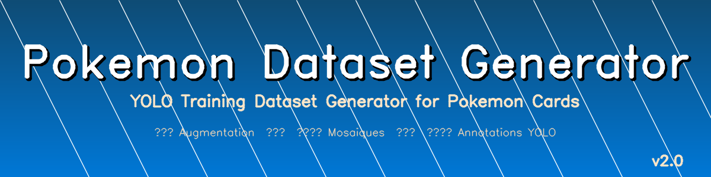
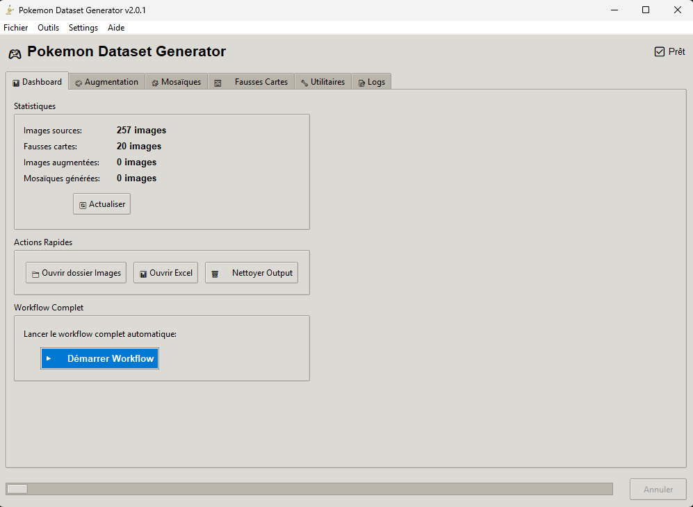
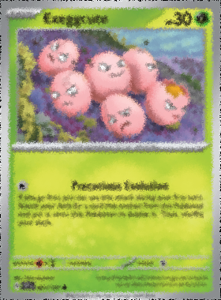
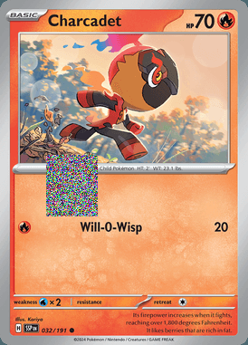
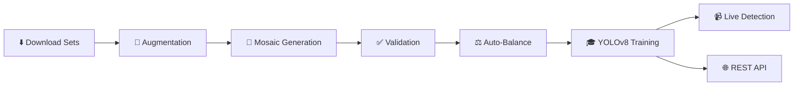

<div align="center">



# 🎮 Pokémon Dataset Generator v3.0

[](https://www.python.org/downloads/)
[](https://opensource.org/licenses/MIT)
[](https://opencv.org/)
[](https://ultralytics.com/)

**Complete YOLO pipeline with modern GUI: Dataset generation → Training → Live detection → REST API**

*Advanced augmentation • Annotated mosaics • YOLOv8 training • Webcam detection • Multi-format export • TCGdex API*

---

[📖 Help Documentation](HELP.md) • [✨ Changelog](NOUVELLES_FONCTIONNALITES.md)

</div>

---

##  Screenshots & Examples

<div align="center">

### Modern GUI Interface


*Real-time dashboard with statistics, environment checks, and quick actions*

---

### Image Processing Pipeline

<table>
<tr>
<td align="center" width="50%">



**Augmented Cards**  
22 transformation types

</td>
<td align="center" width="50%">



**Generated Backgrounds**  
Realistic training data

</td>
</tr>
<tr>
<td align="center" colspan="2">


**Annotated Mosaic - YOLO Format Ready**  
Complete dataset with bounding boxes

</td>
</tr>
</table>

</div>

---

## 🖥️ GUI v3.0 Features

<table>
<tr>
<td width="50%" valign="top">

### 📊 Dashboard (Home)
- Real-time statistics
- Source/Augmented/Mosaic counts
- Dataset size calculation
- Environment verification
- Quick action buttons
- Visual charts (if matplotlib available)

### 🔄 Workflow Manager
- **Quick Pipeline**: Fake → Augment → Mosaic → Train
- **Full Pipeline**: Complete automated process
- **Custom Workflows**: Save/load configurations
- Step-by-step progress tracking
- Real-time logs with colors
- **Stop button** for cancellation

### ⬇️ Image Download (NEW)
- **TCGdex API Integration**: Download card images directly
- **200+ Pokemon Sets**: Dynamic loading from TCGdex API
- **Manual Entry**: Support for any set name/ID
- **Multi-language**: 10 languages (EN, FR, DE, IT, ES, PT, JA, KO, ZH, TH)
- **Quality Options**: High/Low resolution
- **Format Support**: PNG/JPG/WebP
- **Parallel Downloads**: 1-16 workers for speed
- **Auto Manifest**: CSV generation with metadata
- **Free API**: No authentication required

### 🎨 Augmentation
- 1-100 transformations per image
- **Type selection**: Standard / Holographic / Both
- Custom output directory
- **Holographic effects**: Intensity (0.1-1.0), Variations (1-10)
- 22 transformation types
- YOLO annotation generation
- 🌈 **NEW**: Shiny/holographic card simulation

### 📋 Fake Backgrounds
- **NEW**: Dedicated generation view
- Perlin noise-based backgrounds
- Configurable count (10-1000, default: 100)
- Noise intensity (min/max: 0-100)
- Real-time statistics display
- Settings integration

### 🧩 Mosaic Generator
- **3 generation modes**: Quick (200), Standard (500), Complete (900)
- **3 layout modes**: Grid, 3D Rotation, Random
- **3 background modes**: Fake Cards Mosaic, Local Image, Web Image
- **2 transform modes**: 2D Rotation, 3D Perspective
- Batch generation with max_groups parameter
- Annotated YOLO output
- 📋 Integrated fake background generator

### ✅ Dataset Validation
- YOLO format verification
- Detect corrupted images
- Class distribution analysis
- HTML report generation
- Label consistency checks

</td>
<td width="50%" valign="top">

### 🎓 YOLOv8 Training
- Model size selection (n/s/m/l/x)
- Custom epochs, batch size, image size
- Device selection (CPU/GPU)
- Real-time training logs with colors
- Automatic metric export
- Results visualization
- **Stop button** for interruption

### 📹 Live Detection
- **3 modes**: Webcam, Video, Image
- Real-time webcam detection
- Model selection
- Confidence threshold adjustment
- Bounding box visualization
- Detection recording
- Batch image processing

### 🌐 API Server
- **TCGdex integration** (free, no auth)
- Flask REST API server
- Card search and prices
- Excel generation/export
- Server status monitoring

### 🛠️ Menu Tools
**7 Clean Actions**:
1. Clean Outputs
2. Clean Fake Images
3. Clean Holographic
4. Clean Web Backgrounds
5. Clean Training Results
6. Clean All Generated
7. Clean Everything

**Export & Utilities**:
- 📦 Multi-format export (COCO, VOC, TFRecord, Roboflow)
- ⚖️ Auto-balancing
- 📋 Excel & Prices (TCGdex API)
- 🧹 Clean & Reset tools
- ⚙️ Settings dialog (6 tabs)

</td>
</tr>
</table>

---

## 📋 Quick Start

### ⚡ Installation (3 steps)

```batch
# 1️⃣ Clone the repository
git clone https://github.com/lo26lo/pok.git
cd pok

# 2️⃣ Install environment
install_env.bat

# 3️⃣ Launch GUI v3.0
run_gui_v3.bat
```

**✨ That's it! The modern interface is ready to use!**

### 🎯 Optional: Download Pokemon Card Images

Before augmentation, you can download card sets directly from TCGdex API:

```powershell
# Via CLI
python core/image_downloader.py --set "Surging Sparks" --lang "en" --quality "high"

# Or use GUI: ⬇️ Image Download view
# Select a popular set or enter manually → Download to images/
```

---

## ✨ Core Features

<table>
<tr>
<td width="33%" valign="top">

### ⬇️ Image Download (NEW)
- ✅ **TCGdex API** integration (free, no auth)
- ✅ **20 popular sets** quick selection
- ✅ **10 languages** support
- ✅ **Multi-format**: PNG/JPG/WebP
- ✅ **High/Low quality** options
- ✅ **Parallel downloads** (1-16 workers)
- ✅ **Auto manifest** CSV generation
- ✅ **GUI + CLI** interfaces

**Sets:** Surging Sparks, Stellar Crown, Base Set, and more!

</td>
<td width="33%" valign="top">

### 🎨 Advanced Augmentation
- ✅ **22 transformation types**
- ✅ **2-5 simultaneous transforms**
- ✅ **35,420+ combinations**
- ✅ **PNG alpha channel** support
- ✅ **Automatic YOLO** annotations
- ✅ **Unique random seeds**
- 🆕 **Holographic effects** (intensity, variations)
- 🆕 **Standard/Holographic/Both** modes

**Effects:** Blur, Contrast, Saturation, Fog, Posterize, Sharpen, Emboss, Noise, JPEG Compression, Color Temperature, Rainbow gradients, Shimmer patterns, and more!

</td>
<td width="33%" valign="top">

### 🧩 Smart Mosaics
- ✅ **3 layout modes**: Grid, 3D Rotation, Random
- ✅ **3 background modes**: Fake Cards, Local Image, Web
- ✅ **2 transform modes**: 2D, 3D Perspective
- 🆕 **3 generation modes**: Quick (200), Standard (500), Complete (900)
- ✅ **max_groups parameter** for CLI control
- ✅ **252 unique card IDs**
- ✅ **4-point polygon** annotations
- ✅ **YOLOv8 compatible** format

**Output:** Fully configurable (200-900 mosaics)

</td>
</tr>
<tr>
<td colspan="3" valign="top">

### 🎓 YOLOv8 Integration
- ✅ **Complete pipeline** in GUI
- ✅ **Real-time logs** with colors during training
- ✅ **Automatic validation** splits
- ✅ **Metric export** (mAP, precision)
- ✅ **Live detection** from webcam/video/image
- ✅ **Model management**
- 🆕 **Stop button** for interrupting training
- 🆕 **3 detection modes** integrated

**Supported:** YOLOv8n, YOLOv8s, YOLOv8m, YOLOv8l, YOLOv8x

</td>
</tr>
<tr>
<td colspan="3" align="center">

### 🆕 GUI v3.0 Exclusive Features

**📋 Fake Background Generator** (Perlin noise) • **🌈 Holographic Augmentation** (shiny cards) • **🔄 Workflow Manager** (automated pipelines) • **⚙️ Settings Dialog** (6 tabs) • **🛠️ Clean Tools Menu** (7 actions) • **📊 Dashboard** (stats & charts) • **🎨 Catppuccin Mocha** (modern design) • **Stop Button** (cancel operations)
<tr>
<td colspan="3" align="center">

### 🌐 API & Integration

**TCGdex API** (free, no auth) • **Cardmarket prices** • **TCGPlayer prices** • **Excel generation** • **Price updates** • **Card search** • **REST API server** • **Flask endpoint** • **Production ready**

</td>
</tr>
</table>

---

---

## � Project Structure

```
pok/
├── 📱 GUI_v3_modern.py          # Main GUI v3.0 application
├── 🔧 run_gui_v3.bat            # Launcher with venv
├── ⚙️ install_env.bat            # Environment installer
├── 📋 api_config.json           # API configuration
├── 🎨 gui_config.json           # GUI settings
│
├── 📦 core/                     # Modular core package
│   ├── __init__.py              # Package exports
│   ├── utils.py                 # Common utilities + safe_print
│   ├── augmentation.py          # Image augmentation engine
│   ├── mosaic.py                # Mosaic generator
│   ├── dataset_validator.py    # YOLO validation
│   ├── dataset_exporter.py     # Multi-format export
│   ├── auto_balancer.py        # Class balancing
│   ├── holographic_augmenter.py # Holographic effects
│   ├── tcgdex_api.py           # TCGdex API client
│   ├── random_erasing.py       # Random erasing augmentation
│   ├── workflow_manager.py     # Pipeline orchestration
│   ├── training_manager.py     # YOLOv8 training
│   └── detection_manager.py    # Live detection
│
├── 🖼️ images/                   # Source card images
├── 📊 output/                   # Generated datasets
│   ├── augmented/              # Augmented images + labels
│   └── yolov8/                 # Final YOLO dataset
│
├── 📚 docs/                     # Documentation
│   ├── GUI_V3_GUIDE.md         # GUI v3.0 complete guide
│   ├── INTEGRATION_TCGDEX.md   # TCGdex API setup
│   └── ...
│
└── 🛠️ tools/                    # Utility scripts
    ├── test_augmentation.py    # Test augmentation
    └── ...
```

---

## 📚 Documentation

<table>
<tr>
<td width="50%">

### 📖 User Guides
- [📘 HELP.md](HELP.md) - Complete user manual
- [🎨 GUI v3.0 Guide](docs/GUI_V3_GUIDE.md) - Interface guide
- [🔄 Workflow Guide](docs/GUIDE_UTILISATION.md) - Step-by-step
- [🌐 TCGdex Integration](docs/INTEGRATION_TCGDEX.md) - API setup

### 🛠️ Developer Docs
- [🏗️ Core Architecture](core/README.md) - Module documentation
- [🎓 Training Manager](core/training_manager.py) - Annotated code
- [📹 Detection Manager](core/detection_manager.py) - Type hints
- [🔄 Workflow Manager](core/workflow_manager.py) - Pipeline docs

</td>
<td width="50%">

### 📋 Configuration
- [⚙️ API Config](api_config.json.example) - API setup template
- [🎨 GUI Config](gui_config.json) - Interface settings
- [📦 Requirements](requirements.txt) - Dependencies

### 🆕 What's New
- [✨ v3.0 Features](NOUVELLES_FONCTIONNALITES.md) - Changelog
- [🎨 Modern Design](docs/DESIGN_MODERNE_V3.md) - UI/UX
- [🔧 Architecture](docs/README.md) - Technical overview

</td>
</tr>
</table>

---

## 🔄 Complete Workflow


```mermaid
graph LR
    A[⬇️ Download Sets] --> B[🎨 Augmentation]
    B --> C[🧩 Mosaic Generation]
    C --> D[✅ Validation]
    D --> E[⚖️ Auto-Balance]
    E --> F[🎓 YOLOv8 Training]
    F --> G[📹 Live Detection]
    F --> H[🌐 REST API]
```

### Step-by-Step

0. **⬇️ Download Sets** *(Optional)*: Download card images from TCGdex API
1. **📸 Prepare Images**: Place PNG cards in `images/` folder
2. **🎨 Augmentation**: Generate variations with transformations
3. **🧩 Mosaics**: Create YOLO training layouts
4. **✅ Validation**: Verify dataset integrity
5. **⚖️ Balance**: Equalize class distribution
6. **🎓 Training**: Train YOLOv8 model
7. **📹 Detection**: Test with webcam or batch inference
8. **🌐 Deploy**: Launch REST API server

---

## 🎯 Advanced Features

### ⬇️ Image Download (TCGdex API)

**🆕 NEW in v3.0**: Download Pokemon card images directly from TCGdex API with full language and quality support.

#### GUI Usage
- **View**: ⬇️ Image Download (first in GENERATION section)
- **Parameters**:
  - **Set Selection**: Choose from 20 popular sets or enter custom name/ID
  - **Language**: 10 languages (EN, FR, DE, IT, ES, PT, JA, KO, ZH, TH)
  - **Quality**: High or Low resolution
  - **Format**: PNG (recommended), JPG, or WebP
  - **Workers**: 1-16 parallel downloads (default: 8)

#### CLI Usage
```powershell
# Download Surging Sparks in English (PNG, high quality)
python core/image_downloader.py --set "Surging Sparks" --lang "en" --quality "high" --ext "png"

# Download Stellar Crown in French with 12 workers
python core/image_downloader.py --set "sv07" --lang "fr" --workers 12

# Download Base Set in German (JPG, low quality for testing)
python core/image_downloader.py --set "base1" --lang "de" --quality "low" --ext "jpg"
```

#### Python API
```python
from core.image_downloader import ImageDownloader

downloader = ImageDownloader()

# Download set
ok, fail, total = downloader.download_set(
    set_query="Surging Sparks",
    output_dir="images",
    lang="en",
    quality="high",
    ext="png",
    workers=8
)

print(f"Downloaded {ok}/{total} cards successfully")
```

**Features:**
- ✅ **Free API** - No authentication required
- ✅ **20 Popular Sets** - Quick selection (sv08, sv07, base1, etc.)
- ✅ **10 Languages** - Multi-language support
- ✅ **Retry Logic** - Automatic retry on network errors
- ✅ **Manifest Generation** - CSV file with card metadata
- ✅ **Progress Tracking** - Real-time progress updates

**Output Structure:**
```
images/
└── sv08/              # Set folder
    ├── 001.png        # Card images (named by set number)
    ├── 002.png
    ├── ...
    └── manifest.csv   # Metadata (filename, card_id, name, set_number, url)
```

---

### 🌈 Holographic Augmentation

**🆕 NEW in v3.0**: Simulate shiny/holographic effects on Pokemon cards with full parameter control.

#### GUI Usage
- **View**: Augmentation → Type: "Holographic" or "Both"
- **Settings**: Augmentation tab
  - **Intensity**: 0.1-1.0 (default: 0.7) - Controls effect strength
  - **Variations**: 1-10 (default: 3) - Number of variations per card

#### CLI Usage
```bash
# Standard holographic effect
python core/holographic_augmenter.py --input images/ --output images_holographic/

# Custom parameters
python core/holographic_augmenter.py --intensity 0.9 --variations 5
```

#### Python API
```python
from core.holographic_augmenter import HolographicAugmenter

augmenter = HolographicAugmenter()
augmenter.augment_directory(
    "images/", 
    "images_holographic/", 
    intensity=0.7,
    variations=3
)
```

**Effects:** Rainbow gradients, light glare, metallic texture, shimmer patterns, iridescent overlays

**Parameters:**
- `intensity`: 0.1 (subtle) to 1.0 (intense)
- `variations`: Number of different holographic angles

---

### 📋 Fake Background Generation

**🆕 NEW in v3.0**: Advanced Perlin noise-based background generator for realistic training data.

#### GUI Usage
- **Dedicated View**: "Fake Background Generator"
- **Settings**: Fake Backgrounds tab
  - **Count**: 10-1000 (default: 100)
  - **Noise Min**: 0-100 (default: 10)
  - **Noise Max**: 0-100 (default: 50)

#### CLI Usage
```bash
# Generate 100 backgrounds
python tools/generate_fake_backgrounds.py --count 100

# Custom noise range
python tools/generate_fake_backgrounds.py --count 50 --noise_min 20 --noise_max 70
```

**Output:** Realistic synthetic backgrounds in `fakeimg/` for mosaic generation.

---

### 🧩 Mosaic Generation Modes

**🆕 NEW in v3.0**: Three predefined generation modes for different use cases.

#### GUI Usage
Select mode in "Mosaic Generation" view:
- **Quick (200)**: 25 groups × 8 cards ≈ 200 mosaics - Fast testing
- **Standard (500)**: 62 groups × 8 cards ≈ 500 mosaics - Recommended
- **Complete (All)**: 900 mosaics - All combinations (3 layouts × 3 backgrounds × 2 transforms × 50 variations)

#### CLI Usage
```bash
# Standard generation with specific parameters
python core/mosaic.py 1 0 0

# Quick mode (limit to 25 groups)
python core/mosaic.py 1 0 0 25

# Standard mode (limit to 62 groups)
python core/mosaic.py 2 0 1 62

# Complete mode (all combinations)
python core/mosaic.py ALL
```

**Parameters:**
- `layout_mode`: 1 (Grid), 2 (3D Rotation), 3 (Random)
- `background_mode`: 0 (Fake Cards), 1 (Local Image), 2 (Web)
- `transform_mode`: 0 (2D Rotation), 1 (3D Perspective)
- `max_groups` (optional): Limit number of groups generated

---

### ⚖️ Auto-Balancing

Automatically balance class distribution:

```python
from core.auto_balancer import DatasetBalancer

balancer = DatasetBalancer("output/yolov8", target_count=50, strategy='augment')
balancer.balance()
```

**Strategies:** `augment` (increase), `reduce` (decrease), `both` (equalize)

---

### 🧹 Clean & Reset Tools

**🆕 Enhanced in v3.0**: Menu-based clean tools with safety confirmations.

#### 7 Clean Actions Available (via Menu Tools):

1. **🗑️ Clean Outputs**
   - Deletes `output/augmented/` and `output/yolov8/`
   - Preserves source images

2. **📋 Clean Fake Images**
   - Removes `fakeimg/` and `fakeimg_augmented/`
   - Fresh start for background generation

3. **🌈 Clean Holographic**
   - Deletes `images_holographic/`
   - Clear holographic augmentations

4. **🌐 Clean Web Backgrounds**
   - Removes `web/` folder
   - Downloaded web images cleanup

5. **🎓 Clean Training Results**
   - Deletes `runs/train/`
   - Remove trained models and logs

6. **🧹 Clean All Generated**
   - Removes all generated folders
   - **Preserves source `images/` folder**
   - Safe reset to start fresh

7. **🚨 Clean Everything**
   - Nuclear option: Deletes ALL data
   - Optional: Include `images/` folder (checkbox)
   - **Double confirmation required**
   - Detailed logs of deleted folders

**Safety Features:**
- ✅ Confirmation dialogs for all actions
- ✅ Double confirmation for destructive operations
- ✅ Detailed logs of deleted folders
- ✅ Error handling and reporting

**Access:** GUI v3.0 → Menu bar → **Tools** → Select clean action

---### 📦 Multi-Format Export

Export to multiple formats:

```python
from core.dataset_exporter import DatasetExporter

exporter = DatasetExporter("output/yolov8")
exporter.export_coco("output/coco.json")
exporter.export_voc("output/voc/")
exporter.export_tfrecord("output/dataset.tfrecord")
exporter.export_roboflow("output/roboflow.zip")
```

### 🌐 REST API Server

Deploy detection as a REST API:

```bash
# Launch Flask server
python api_server.py

# Test endpoint
curl -X POST -F "image=@card.jpg" http://localhost:5000/detect
```

**Response:**
```json
{
  "detections": [
    {"class": "Pikachu", "confidence": 0.95, "bbox": [x, y, w, h]},
    {"class": "Charizard", "confidence": 0.89, "bbox": [x, y, w, h]}
  ],
  "count": 2
}
```

---

## 🎴 TCGdex API Integration

### Generate Card Lists

```python
from core.tcgdex_api import TCGdexAPI

api = TCGdexAPI(language="en")
cards = api.search_card("Pikachu")
api.generate_extension_excel("Surging Sparks", "cards.xlsx")
```

### Update Prices

```python
# Add Cardmarket + TCGPlayer prices to Excel
api.update_card_prices_excel("cards.xlsx", "cards_with_prices.xlsx")
```

### Search with Prices

```python
price, price_max, details = api.search_card_with_prices("Charizard", "Base Set")
print(f"Price: {price} EUR (max: {price_max})")
```

**Features:**
- ✅ Free API, no authentication
- ✅ Multi-language support (10 languages)
- ✅ Cardmarket + TCGPlayer prices
- ✅ Excel generation
- ✅ Batch price updates

[📖 Read TCGdex documentation →](docs/INTEGRATION_TCGDEX.md)

---

## ⚙️ Settings & Configuration

### 🆕 GUI Settings Dialog (⚙️ button)

**6 Configuration Tabs:**

#### 1️⃣ General
- **Paths**: Images, output, augmented, mosaic, fakeimg, holographic
- **Options**: Auto-save logs, show notifications

#### 2️⃣ Augmentation
- **Count**: Default augmentations (1-100)
- **Type**: Standard / Holographic / Both
- **Holographic Intensity**: 0.1-1.0 (via slider)
- **Holographic Variations**: 1-10 (via spinbox)

#### 3️⃣ Mosaic
- **Generation Mode**: Quick / Standard / Complete
- **Card Layout**: Grid, 3D Rotation, Random (1-3)
- **Background**: Fake Cards, Local Image, Web (0-2)
- **Transform**: 2D Rotation, 3D Perspective (0-1)

#### 4️⃣ Fake Backgrounds
- **Default Count**: 10-1000 (default: 100)
- **Noise Min**: 0-100 (default: 10)
- **Noise Max**: 0-100 (default: 50)

#### 5️⃣ Training
- **Model**: YOLOv8 size (n/s/m/l/x)
- **Epochs**: Training iterations
- **Batch Size**: Images per batch
- **Device**: CPU / GPU selection

#### 6️⃣ Advanced
- **TCGdex API Key**: Optional API configuration
- **Other advanced parameters**

**Settings saved to** `gui_config.json` and persist between sessions.

### API Configuration

Edit `api_config.json` to configure TCGdex:

```json
{
  "api_source": "tcgdex",
  "language": "en"
}
```

Supported languages: `en`, `fr`, `es`, `it`, `pt`, `de`, `ja`, `zh`, `id`, `th`

---

## 🐛 Troubleshooting

### Common Issues

**Q: GUI doesn't start**
- Ensure virtual environment is active: `run_gui_v3.bat`
- Check Python version: `python --version` (3.12+)
- Reinstall: `install_env.bat`

**Q: NumPy errors**
- Use NumPy < 2.0 (installed automatically)
- Patch applied in `core/utils.py`

**Q: No logs during operations**
- Fixed in v3.0 with `-u` flag (unbuffered output)
- Check `bufsize=1` in subprocess calls

**Q: Unicode errors on Windows**
- Fixed with `safe_print()` function
- Automatic fallback to ASCII

**Q: Environment check fails**
- Run `install_env.bat` to create `.venv`
- Verify: `.venv/Scripts/python.exe` exists

---

## � Credits & Acknowledgments

### Inspiration

This project was inspired by the research paper:
- 📄 **[Real-Time Pokemon Card Detection from Tournament Footage](https://cs231n.stanford.edu/2024/papers/real-time-pokemon-card-detection-from-tournament-footage.pdf)** - Stanford CS231n (2024)

The paper's approach to card detection in tournament settings motivated the development of this comprehensive dataset generation and training pipeline.

### Technologies & Libraries

- 🔥 **[YOLOv8](https://github.com/ultralytics/ultralytics)** - Ultralytics for state-of-the-art object detection
- 🎨 **[OpenCV](https://opencv.org/)** - Computer vision and image processing
- 🖼️ **[imgaug](https://github.com/aleju/imgaug)** - Advanced image augmentation
- 🎴 **[TCGdex API](https://tcgdex.net/)** - Pokemon TCG card database and pricing
- 🎭 **[Pillow](https://python-pillow.org/)** - Image manipulation
- 🐼 **[Pandas](https://pandas.pydata.org/)** - Data processing and Excel integration
- 🌐 **[Flask](https://flask.palletsprojects.com/)** - REST API server
- 🎨 **[Catppuccin](https://github.com/catppuccin/catppuccin)** - Modern color scheme

### Special Thanks

- Pokemon Company International for the amazing TCG
- Stanford CS231n course for computer vision research
- Open source community for incredible tools
- All contributors and users of this project

---

## �📄 License

MIT License - See [LICENSE](LICENSE) file

---

## 🤝 Contributing

Contributions welcome! Please:
1. Fork the repository
2. Create a feature branch
3. Commit your changes
4. Push to the branch
5. Open a Pull Request

---

## 📧 Support

-  [Read documentation](docs/)
- 💬 [Discussions](https://github.com/lo26lo/pok/discussions)

---

<div align="center">

**Made with ❤️ for Pokemon TCG collectors and AI enthusiasts**

⭐ Star this repo if you find it useful!

[🏠 Home](#-pokémon-dataset-generator-v30) • [📖 Docs](#-documentation) • [🚀 Install](#-quick-start) • [🎯 Features](#-core-features)

</div>
