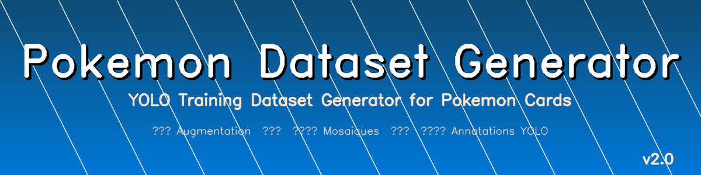

<div align="center">



# 🎮 Pokémon Dataset Generator v3.0

[](https://www.python.org/downloads/)
[](https://opensource.org/licenses/MIT)
[](https://opencv.org/)
[](https://ultralytics.com/)

**Complete YOLO pipeline with modern GUI: Dataset generation → Training → Live detection → REST API**

*Advanced augmentation • Annotated mosaics • YOLOv8 training • Webcam detection • Multi-format export • TCGdex API*

---

[🇫🇷 Version Française](README_FR.md) • [📖 Help Documentation](HELP.md) • [✨ Changelog](NOUVELLES_FONCTIONNALITES.md)

</div>

---

## � Screenshots & Examples

<div align="center">

### Modern GUI Interface


*Real-time dashboard with statistics, environment checks, and quick actions*

---

### Image Processing Pipeline

<table>
<tr>
<td align="center" width="50%">


**Augmented Cards** - 22 transformation types

</td>
<td align="center" width="50%">


**Annotated Mosaic** - YOLO format ready

</td>
</tr>
<tr>
<td align="center" width="50%">


**Grid Mosaic** - Structured card placement

</td>
<td align="center" width="50%">


**Generated Backgrounds** - Realistic training data

</td>
</tr>
</table>

</div>

---

## 📋 Quick Start

### ⚡ Installation (3 steps)

```batch
# 1️⃣ Clone the repository
git clone https://github.com/lo26lo/pok.git
cd pok

# 2️⃣ Install environment
install_env.bat

# 3️⃣ Launch GUI v3.0
run_gui_v3.bat
```

**✨ That's it! The modern interface is ready to use!**

---

## 🖥️ GUI v3.0 Features

<table>
<tr>
<td width="50%" valign="top">

### 📊 Dashboard (Home)
- Real-time statistics
- Source/Augmented/Mosaic counts
- Dataset size calculation
- Environment verification
- Quick action buttons

### 🔄 Automatic Workflow
- 5-step pipeline
- Augmentation → Mosaic → Validation → Balance → Training
- Configurable steps
- Progress tracking
- Real-time logs

### 🎨 Augmentation
- Configure transformation count
- Custom output directory
- Multiple augmentation types
- YOLO annotation generation

### 🧩 Mosaic Generator
- 3 layout modes (Grid/Rotation/Random)
- Background selection
- Batch generation
- Annotated output

### ✅ Dataset Validation
- YOLO format verification
- Detect corrupted images
- Class distribution analysis
- HTML report generation

</td>
<td width="50%" valign="top">

### 🎓 YOLOv8 Training
- Model size selection (n/s/m/l/x)
- Custom epochs
- Image size configuration
- Real-time training logs
- Automatic metric export

### 📹 Live Detection
- Webcam real-time detection
- Model selection
- Confidence threshold
- Bounding box visualization
- Detection recording

### 📦 Export Tools
- COCO JSON format
- Pascal VOC XML
- TFRecord (TensorFlow)
- Roboflow ZIP
- Multi-format batch export

### 🛠️ Utilities
- 📋 Excel & Prices (TCGdex API)
- ⚖️ Auto-balancing
- 🌈 Holographic augmentation
- 🌐 TCG Browser
- 🧹 Clean & Reset tools
- ⚙️ Settings dialog

</td>
</tr>
</table>

---

## ✨ Core Features

<table>
<tr>
<td width="33%" valign="top">

### 🎨 Advanced Augmentation
- ✅ **22 transformation types**
- ✅ **2-5 simultaneous transforms**
- ✅ **35,420+ combinations**
- ✅ **PNG alpha channel** support
- ✅ **Automatic YOLO** annotations
- ✅ **Unique random seeds**

**Effects:** Blur, Contrast, Saturation, Fog, Posterize, Sharpen, Emboss, Noise, JPEG Compression, Color Temperature, and more!

</td>
<td width="33%" valign="top">

### 🧩 Smart Mosaics
- ✅ **3 layout modes**: Grid, Rotation, Random
- ✅ **3 background modes**: Mosaic, Local, Web
- ✅ **2 transform modes**: 2D, 3D Perspective
- ✅ **252 unique card IDs**
- ✅ **4-point polygon** annotations
- ✅ **YOLOv8 compatible** format

**Output:** 65 layouts by default, fully configurable

</td>
<td width="33%" valign="top">

### 🎓 YOLOv8 Integration
- ✅ **Complete pipeline** in GUI
- ✅ **Real-time logs** during training
- ✅ **Automatic validation** splits
- ✅ **Metric export** (mAP, precision)
- ✅ **Live detection** from webcam
- ✅ **Model management**

**Supported:** YOLOv8n, YOLOv8s, YOLOv8m, YOLOv8l, YOLOv8x

</td>
</tr>
<tr>
<td colspan="3" align="center">

### 🌐 API & Integration

**TCGdex API** (free, no auth) • **Cardmarket prices** • **TCGPlayer prices** • **Excel generation** • **Price updates** • **Card search** • **REST API server** • **Flask endpoint** • **Production ready**

</td>
</tr>
</table>

---

## � Screenshots & Examples

<div align="center">

### GUI v3.0 Interface


*Modern dashboard with real-time statistics and environment checks*

---

### Image Processing Pipeline

<table>
<tr>
<td align="center" width="50%">


**Augmented Cards** - 22 transformation types

</td>
<td align="center" width="50%">


**Annotated Mosaic** - YOLO format ready

</td>
</tr>
<tr>
<td align="center" width="50%">


**Grid Mosaic** - Structured card placement

</td>
<td align="center" width="50%">


**Generated Backgrounds** - For realistic training

</td>
</tr>
</table>

</div>

---


</td>
</tr>
</table>

---

## � Project Structure

```
pok/
├── 📱 GUI_v3_modern.py          # Main GUI v3.0 application
├── 🔧 run_gui_v3.bat            # Launcher with venv
├── ⚙️ install_env.bat            # Environment installer
├── 📋 api_config.json           # API configuration
├── 🎨 gui_config.json           # GUI settings
│
├── 📦 core/                     # Modular core package
│   ├── __init__.py              # Package exports
│   ├── utils.py                 # Common utilities + safe_print
│   ├── augmentation.py          # Image augmentation engine
│   ├── mosaic.py                # Mosaic generator
│   ├── dataset_validator.py    # YOLO validation
│   ├── dataset_exporter.py     # Multi-format export
│   ├── auto_balancer.py        # Class balancing
│   ├── holographic_augmenter.py # Holographic effects
│   ├── tcgdex_api.py           # TCGdex API client
│   ├── random_erasing.py       # Random erasing augmentation
│   ├── workflow_manager.py     # Pipeline orchestration
│   ├── training_manager.py     # YOLOv8 training
│   └── detection_manager.py    # Live detection
│
├── 🖼️ images/                   # Source card images
├── 📊 output/                   # Generated datasets
│   ├── augmented/              # Augmented images + labels
│   └── yolov8/                 # Final YOLO dataset
│
├── 📚 docs/                     # Documentation
│   ├── GUI_V3_GUIDE.md         # GUI v3.0 complete guide
│   ├── INTEGRATION_TCGDEX.md   # TCGdex API setup
│   └── ...
│
└── 🛠️ tools/                    # Utility scripts
    ├── test_augmentation.py    # Test augmentation
    └── ...
```

---

## 📚 Documentation

<table>
<tr>
<td width="50%">

### 📖 User Guides
- [📘 HELP.md](HELP.md) - Complete user manual
- [🎨 GUI v3.0 Guide](docs/GUI_V3_GUIDE.md) - Interface guide
- [🔄 Workflow Guide](docs/GUIDE_UTILISATION.md) - Step-by-step
- [🌐 TCGdex Integration](docs/INTEGRATION_TCGDEX.md) - API setup

### 🛠️ Developer Docs
- [🏗️ Core Architecture](core/README.md) - Module documentation
- [🎓 Training Manager](core/training_manager.py) - Annotated code
- [📹 Detection Manager](core/detection_manager.py) - Type hints
- [🔄 Workflow Manager](core/workflow_manager.py) - Pipeline docs

</td>
<td width="50%">

### 📋 Configuration
- [⚙️ API Config](api_config.json.example) - API setup template
- [🎨 GUI Config](gui_config.json) - Interface settings
- [📦 Requirements](requirements.txt) - Dependencies

### 🆕 What's New
- [✨ v3.0 Features](NOUVELLES_FONCTIONNALITES.md) - Changelog
- [🎨 Modern Design](docs/DESIGN_MODERNE_V3.md) - UI/UX
- [🔧 Architecture](docs/README.md) - Technical overview

</td>
</tr>
</table>

---

## 🔄 Complete Workflow

```mermaid
graph LR
    A[📸 Source Images] --> B[🎨 Augmentation]
    B --> C[🧩 Mosaic Generation]
    C --> D[✅ Validation]
    D --> E[⚖️ Auto-Balance]
    E --> F[🎓 YOLOv8 Training]
    F --> G[📹 Live Detection]
    F --> H[🌐 REST API]
```



### Step-by-Step

1. **📸 Prepare Images**: Place PNG cards in `images/` folder
2. **🎨 Augmentation**: Generate variations with transformations
3. **🧩 Mosaics**: Create YOLO training layouts
4. **✅ Validation**: Verify dataset integrity
5. **⚖️ Balance**: Equalize class distribution
6. **🎓 Training**: Train YOLOv8 model
7. **📹 Detection**: Test with webcam or batch inference
8. **🌐 Deploy**: Launch REST API server

---

## 🎯 Advanced Features

### 🌈 Holographic Augmentation

Simulate shiny/holographic effects on Pokemon cards:

```python
from core.holographic_augmenter import HolographicAugmenter

augmenter = HolographicAugmenter()
augmenter.augment_directory("images/", "images_holographic/", variations=5)
```

**Effects:** Rainbow gradients, light glare, metallic texture, shimmer patterns

### ⚖️ Auto-Balancing

Automatically balance class distribution:

```python
from core.auto_balancer import DatasetBalancer

balancer = DatasetBalancer("output/yolov8", target_count=50, strategy='augment')
balancer.balance()
```

**Strategies:** `augment` (increase), `reduce` (decrease), `both` (equalize)

### 🧹 Clean & Reset Tools

Clean generated files and folders with safety confirmations:

**Individual Clean Actions:**
- 🗑️ **Clean Output**: Delete entire `output/` folder
- 🎨 **Clean Augmented**: Delete `output/augmented/`
- 🧩 **Clean Mosaics**: Delete `output/yolov8/`
- 🎓 **Clean Training**: Delete `runs/` (trained models)
- 🌈 **Clean Holographic**: Delete `images_holographic/`
- 📋 **Clean Fakeimg**: Delete fake background folders

**Clean All:**
- 🚨 Deletes all generated folders (output, runs, holographic, fakeimg)
- Optional: Include `images/` folder (unchecked by default)
- Double confirmation for safety
- Detailed logs of deleted folders

**Access:** GUI → Tools → Clean & Reset section

### 📦 Multi-Format Export

Export to multiple formats:

```python
from core.dataset_exporter import DatasetExporter

exporter = DatasetExporter("output/yolov8")
exporter.export_coco("output/coco.json")
exporter.export_voc("output/voc/")
exporter.export_tfrecord("output/dataset.tfrecord")
exporter.export_roboflow("output/roboflow.zip")
```

### 🌐 REST API Server

Deploy detection as a REST API:

```bash
# Launch Flask server
python api_server.py

# Test endpoint
curl -X POST -F "image=@card.jpg" http://localhost:5000/detect
```

**Response:**
```json
{
  "detections": [
    {"class": "Pikachu", "confidence": 0.95, "bbox": [x, y, w, h]},
    {"class": "Charizard", "confidence": 0.89, "bbox": [x, y, w, h]}
  ],
  "count": 2
}
```

---

## 🎴 TCGdex API Integration

### Generate Card Lists

```python
from core.tcgdex_api import TCGdexAPI

api = TCGdexAPI(language="en")
cards = api.search_card("Pikachu")
api.generate_extension_excel("Surging Sparks", "cards.xlsx")
```

### Update Prices

```python
# Add Cardmarket + TCGPlayer prices to Excel
api.update_card_prices_excel("cards.xlsx", "cards_with_prices.xlsx")
```

### Search with Prices

```python
price, price_max, details = api.search_card_with_prices("Charizard", "Base Set")
print(f"Price: {price} EUR (max: {price_max})")
```

**Features:**
- ✅ Free API, no authentication
- ✅ Multi-language support (10 languages)
- ✅ Cardmarket + TCGPlayer prices
- ✅ Excel generation
- ✅ Batch price updates

[📖 Read TCGdex documentation →](docs/INTEGRATION_TCGDEX.md)

---

## ⚙️ Settings & Configuration

### GUI Settings (⚙️ button)

- **General**: Paths, auto-save, notifications
- **Augmentation**: Transform count, intensity
- **Training**: Default epochs, image size, model
- **Advanced**: Batch size, confidence threshold

Settings are saved to `gui_config.json` and persist between sessions.

### API Configuration

Edit `api_config.json` to configure TCGdex:

```json
{
  "api_source": "tcgdex",
  "language": "en"
}
```

Supported languages: `en`, `fr`, `es`, `it`, `pt`, `de`, `ja`, `zh`, `id`, `th`

---

## 🐛 Troubleshooting

### Common Issues

**Q: GUI doesn't start**
- Ensure virtual environment is active: `run_gui_v3.bat`
- Check Python version: `python --version` (3.12+)
- Reinstall: `install_env.bat`

**Q: NumPy errors**
- Use NumPy < 2.0 (installed automatically)
- Patch applied in `core/utils.py`

**Q: No logs during operations**
- Fixed in v3.0 with `-u` flag (unbuffered output)
- Check `bufsize=1` in subprocess calls

**Q: Unicode errors on Windows**
- Fixed with `safe_print()` function
- Automatic fallback to ASCII

**Q: Environment check fails**
- Run `install_env.bat` to create `.venv`
- Verify: `.venv/Scripts/python.exe` exists

---

## � Credits & Acknowledgments

### Inspiration

This project was inspired by the research paper:
- 📄 **[Real-Time Pokemon Card Detection from Tournament Footage](https://cs231n.stanford.edu/2024/papers/real-time-pokemon-card-detection-from-tournament-footage.pdf)** - Stanford CS231n (2024)

The paper's approach to card detection in tournament settings motivated the development of this comprehensive dataset generation and training pipeline.

### Technologies & Libraries

- 🔥 **[YOLOv8](https://github.com/ultralytics/ultralytics)** - Ultralytics for state-of-the-art object detection
- 🎨 **[OpenCV](https://opencv.org/)** - Computer vision and image processing
- 🖼️ **[imgaug](https://github.com/aleju/imgaug)** - Advanced image augmentation
- 🎴 **[TCGdex API](https://tcgdex.net/)** - Pokemon TCG card database and pricing
- 🎭 **[Pillow](https://python-pillow.org/)** - Image manipulation
- 🐼 **[Pandas](https://pandas.pydata.org/)** - Data processing and Excel integration
- 🌐 **[Flask](https://flask.palletsprojects.com/)** - REST API server
- 🎨 **[Catppuccin](https://github.com/catppuccin/catppuccin)** - Modern color scheme

### Special Thanks

- Pokemon Company International for the amazing TCG
- Stanford CS231n course for computer vision research
- Open source community for incredible tools
- All contributors and users of this project

---

## �📄 License

MIT License - See [LICENSE](LICENSE) file

---

## 🤝 Contributing

Contributions welcome! Please:
1. Fork the repository
2. Create a feature branch
3. Commit your changes
4. Push to the branch
5. Open a Pull Request

---

## 📧 Support

- 📝 [Open an issue](https://github.com/lo26lo/pok/issues)
- 📖 [Read documentation](docs/)
- 💬 [Discussions](https://github.com/lo26lo/pok/discussions)

---

<div align="center">

**Made with ❤️ for Pokemon TCG collectors and AI enthusiasts**

⭐ Star this repo if you find it useful!

[🏠 Home](#-pokémon-dataset-generator-v30) • [📖 Docs](#-documentation) • [🚀 Install](#-quick-start) • [🎯 Features](#-core-features)

</div>
