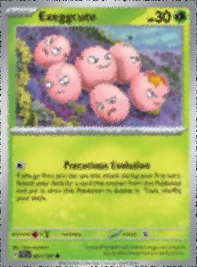
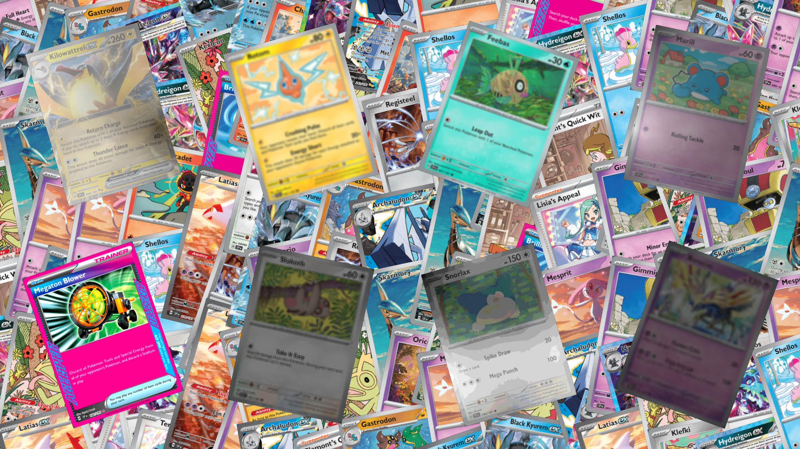

<div align="center">


# 🎮 Pokémon Dataset Generator

[](https://www.python.org/downloads/)
[](https://opensource.org/licenses/MIT)
[](https://opencv.org/)
[](https://github.com/aleju/imgaug)

**Générateur automatique de datasets d'entraînement YOLO pour cartes Pokémon**

*Augmentation avancée • Mosaïques annotées • Pipeline complet*

---

[🇬🇧 English Version](README.md)

</div>

## 🖼️ Exemples de Génération

<div align="center">

### 📸 Workflow Complet

</div>

<table>
<tr>
<td align="center" width="25%">

<br/>
<strong>① Fake Background</strong>
<br/>
<sub>Random Erasing + Augmentation</sub>
</td>
<td align="center" width="25%">

<br/>
<strong>② Augmented Card</strong>
<br/>
<sub>22 transformations possibles</sub>
</td>
<td align="center" width="25%">

<br/>
<strong>③ YOLO Layout</strong>
<br/>
<sub>Mosaïque 8 cartes</sub>
</td>
<td align="center" width="25%">

<br/>
<strong>④ Bounding Boxes</strong>
<br/>
<sub>Annotations visualisées</sub>
</td>
</tr>
</table>

<div align="center">

### 📝 Format d'Annotation YOLO


<sub>Format: `class_id x_center y_center width height` (normalisé 0-1)</sub>

---

</div>

## 📋 Table des Matières

<div align="center">

| Section | Description |
|---------|-------------|
| [✨ Fonctionnalités](#-fonctionnalités) | Liste complète des fonctionnalités |
| [🚀 Installation](#-installation) | Guide d'installation rapide |
| [📖 Utilisation](#-utilisation) | Comment utiliser le générateur |
| [📁 Structure](#-structure-du-projet) | Organisation des fichiers |
| [🖥️ GUI v2.0](#️-gui-v20) | Interface graphique moderne |
| [🔄 Workflow](#-workflow) | Pipeline de génération |
| [📚 Documentation](#-documentation) | Guides et documentation |

</div>

---

## ✨ Fonctionnalités

<table>
<tr>
<td width="33%" valign="top">

### 🎨 Augmentation d'Images
- ✅ **22 types de transformations**
- ✅ **2-5 transformations** par image
- ✅ **~35,420 combinaisons** possibles
- ✅ Support **PNG avec alpha** (RGBA)
- ✅ Annotations **YOLO** automatiques
- ✅ Seed aléatoire unique
- 🎯 **Effets** : Flou, contraste, saturation, fog, posterize, sharpen, emboss, bruit, compression JPEG, température couleur

</td>
<td width="33%" valign="top">

### 🧩 Génération de Mosaïques
- ✅ **3 modes de layout** : Grille, Rotation, Aléatoire
- ✅ **3 modes de background** : Mosaïque, Local, Web
- ✅ **2 modes de transformation** : 2D, Perspective 3D
- ✅ **252 cartes** avec IDs uniques
- ✅ Annotations **YOLO** polygones 4 points
- ✅ Format **YOLOv8** compatible
- 🎯 **Output** : 65 layouts par défaut

</td>
<td width="33%" valign="top">

### 🖼️ Fausses Cartes
- ✅ **Random Erasing** configurable
- ✅ Probabilité **0.0 - 1.0**
- ✅ Workflow automatique
- ✅ Utilisées comme **fond** de mosaïque
- 🔄 **Pipeline** : images → Random Erasing → fakeimg → Augmentation → fakeimg_augmented

</td>
</tr>
<tr>
<td colspan="3" align="center">

### 🖥️ Interface Graphique v2.0

**Dashboard** • **Validation automatique** • **Barre de progression** • **Multi-threading** • **Configuration persistante**

</td>
</tr>
</table>

---

## 🚀 Installation

<table>
<tr>
<td width="50%" valign="top">

### 📋 Prérequis

| Élément | Version | Statut |
|---------|---------|--------|
| **Python** | 3.12+ | ✅ Recommandé |
| **OS** | Windows 10/11 | ✅ Scripts batch |
| **Git** | Dernière | ⚠️ Optionnel |
| **Espace disque** | ~2 GB | Pour env + datasets |

</td>
<td width="50%" valign="top">

### ⚡ Installation Rapide

```batch
# 1️⃣ Cloner le dépôt
git clone https://github.com/lo26lo/pok.git
cd pok/Pokemons

# 2️⃣ Installation automatique
install_env.bat
```

**✨ L'installateur configure tout automatiquement !**

</td>
</tr>
</table>

<details>
<summary>📦 <b>Que fait install_env.bat ?</b></summary>

<br/>

```
1. 🔍 Détecte Python 3.12 (ou installe si absent)
2. 📦 Crée environnement virtuel .venv
3. ⬇️  Installe toutes les dépendances :
   - opencv-python (traitement d'images)
   - pandas (manipulation Excel)
   - imgaug (augmentation)
   - numpy < 2.0 (compatibilité)
   - pillow, requests, scipy, scikit-image
4. ✅ Vérifie l'installation
5. 🎉 Prêt à utiliser !
```

</details>

<details>
<summary>🛠️ <b>Installation Manuelle</b></summary>

<br/>

```batch
# Créer l'environnement virtuel
python -m venv .venv

# Activer
.venv\Scripts\activate

# Installer
pip install -r requirements.txt
```

</details>

<details>
<summary>🔑 <b>Configuration API (Optionnel)</b></summary>

<br/>

Pour les fonctionnalités API (génération de listes, mise à jour des prix) :

```batch
# 1. Copier le fichier exemple
copy api_config.json.example api_config.json

# 2. Choisir votre source API dans api_config.json
```

**🆕 NOUVEAU :** 3 sources API disponibles !

| Source API | Région | Authentification | Vitesse | Coût |
|------------|--------|------------------|---------|------|
| **TCGdex** ⭐ | 🌍 Mondial | ❌ Aucune | ⚡ Ultra-rapide | 💰 GRATUIT |
| **Pokemon TCG** | 🇺🇸 USA | ✅ Clé API | 🐌 Moyen | 💰 GRATUIT |
| **Cardmarket** | 🇪🇺 Europe | ✅ OAuth 1.0 | 🐌 Lent | 💰 GRATUIT |

**⭐ Recommandé : TCGdex** (aucune configuration, combine prix Cardmarket + TCGPlayer)

**Configuration :**
- **TCGdex** : Sélectionnez simplement la langue (fr, en, es, it, pt, de, ja, zh, id, th)
- **Pokemon TCG** : Obtenez une clé sur https://pokemontcg.io/
- **Cardmarket** : Créez une App dédiée sur https://cardmarket.com/API

Voir documentation :
- [INTEGRATION_CARDMARKET.md](docs/INTEGRATION_CARDMARKET.md) - Configuration Cardmarket
- [API_CONFIG_README.md](API_CONFIG_README.md) - Guide API général

</details>

---

## 📖 Utilisation

<div align="center">

### 🖥️ Méthode 1 : Interface Graphique (Recommandé)

</div>

<table>
<tr>
<td width="50%" align="center">

**🎯 Lancement Rapide**

```batch
# Avec console (développement)
run_gui_v2_with_env.bat

# Sans console (utilisation)
Pokemon_Dataset_Generator.bat
```

**Interface moderne avec workflow complet**

</td>
<td width="50%" align="center">

**✨ Fonctionnalités GUI**

✅ Dashboard statistiques  
✅ Configuration visuelle  
✅ Barre de progression  
✅ Validation automatique  
✅ Multi-threading  
✅ Sans fenêtre console  

</td>
</tr>
</table>

<details>
<summary>📦 <b>Créer un Executable Windows (.exe)</b></summary>

<br/>

Pour créer une version portable sans Python :

```batch
# 1️⃣ Lancer la création (une seule fois)
tools\create_exe.bat

# Résultat après 5-10 minutes :
# ✅ dist/Pokemon_Dataset_Generator.exe (executable seul)
# ✅ dist/Pokemon_Dataset_Generator_Portable/ (package complet)
```

**📦 Package Portable Créé :**
- ✅ **Aucune installation** Python requise
- ✅ **Toutes les dépendances** incluses
- ✅ **Prêt à distribuer** (zipper le dossier Portable)
- ✅ **Double-clic** pour lancer
- ✅ **~200 MB** (taille totale)

**🛠️ Personnalisation :**

Éditez `tools/create_exe.py` pour :
- Ajouter une icône personnalisée (`--icon=mon_icone.ico`)
- Modifier les fichiers inclus
- Ajuster les options PyInstaller

📖 Guide complet : [docs/CREATION_EXE.md](docs/CREATION_EXE.md)

</details>
</table>

<div align="center">

### ⌨️ Méthode 2 : Ligne de Commande

</div>

<details>
<summary>🎨 <b>Augmentation d'Images</b></summary>

<br/>

```batch
# Activer l'environnement
.venv\Scripts\activate

# Générer 30 augmentations par carte
python augmentation.py --num_aug 30 --target augmented

# Test rapide (5 augmentations)
test_augmentation.bat
```

**Options disponibles :**
- `--num_aug` : Nombre d'augmentations par image (défaut: 30)
- `--target` : Destination (`augmented` ou `images_aug`)

</details>

<details>
<summary>🧩 <b>Génération de Mosaïques</b></summary>

<br/>

```batch
# Syntaxe : python mosaic.py <layout_mode> <background_mode> <transform_mode>
python mosaic.py 1 0 0

# Layout: 0=Grille, 1=Rotation, 2=Aléatoire
# Background: 0=Mosaïque, 1=Local, 2=Web
# Transform: 0=2D, 1=Perspective 3D
```

**Exemples :**
```batch
python mosaic.py 1 0 0  # Rotation + Mosaïque + 2D
python mosaic.py 2 1 1  # Aléatoire + Local + 3D
python mosaic.py 0 2 0  # Grille + Web + 2D
```

</details>

<details>
<summary>🖼️ <b>Fausses Cartes (Random Erasing)</b></summary>

<br/>

```batch
# Générer des fausses cartes
python randomerasing.py --input_dir images --output_dir fakeimg --p 0.8 --sh 0.5
```

**Options :**
- `--p` : Probabilité d'effacement (0.0 - 1.0)
- `--sh` : Ratio d'effacement (0.0 - 1.0)
- `--input_dir` : Dossier source
- `--output_dir` : Dossier destination

</details>

<details>
<summary>🧪 <b>Test de Variété des Augmentations</b></summary>

<br/>

```batch
# Générer 10 augmentations d'une carte pour comparer
test_augmentation_variety.bat

# Résultats dans : test_augmentation_output/
```

Compare visuellement la variété du pipeline amélioré (22 transformations).

</details>

---

## 📁 Structure du Projet

```
Pokemons/
├── 📱 GUI_v2.py                    # Interface graphique moderne
├── 🎨 augmentation.py              # Script d'augmentation
├── 🧩 mosaic.py                    # Génération de mosaïques
├── � cards_info.xlsx              # Informations des cartes
├── 📦 requirements.txt             # Dépendances Python
├── 🔧 gui_config.json              # Configuration GUI (auto-généré)
├── � pikachu.ico                  # Icône Mimikyu
│
├── 🚀 Fichiers de Lancement
│   ├── Pokemon_Dataset_Generator.bat    # 🔇 Lancer sans console
│   ├── run_gui_v2_with_env.bat          # �️ Lancer avec console
│   ├── run_gui_silent.bat               # Launcher pythonw
│   ├── invisible.vbs                    # Script VBS silencieux
│   ├── install_env.bat                  # Installation environnement
│   └── pokemon_dataset_generator.spec   # Config PyInstaller
│
├── 📂 tools/                       # 🛠️ Utilitaires et scripts de développement
│   ├── create_pikachu_icon.py     # Générateur d'icône
│   ├── create_exe.py              # Créer executable Windows
│   ├── create_exe.bat             # Wrapper création exe
│   ├── test_*.bat                 # Scripts de test
│   ├── check_excel.py             # Vérification Excel
│   └── ...autres utilitaires
│
├── 📂 docs/                        # 📚 Documentation complète
│   ├── GUIDE_UTILISATION.md       # Guide utilisateur
│   ├── CREATION_EXE.md            # Guide création executable
│   ├── CHANGELOG_GUI_V2.md        # Historique GUI
│   └── ...autres docs
│
├── 📂 Dossiers de Données
│   ├── images/                    # 📥 Cartes sources (INPUT)
│   ├── fakeimg/                   # Fausses cartes brutes (générées par Random Erasing)
│   ├── fakeimg_augmented/         # Fausses cartes augmentées (utilisées comme fond pour mosaïques)
│   ├── examples/                  # 🖼️ Images d'exemple pour README
│   └── output/
│       ├── augmented/
│       │   ├── images/            # 📤 Images augmentées (OUTPUT - générées)
│       │   ├── labels/            # Annotations YOLO (générées)
│       │   └── data.yaml          # Config YOLO
│       └── yolov8/
│           ├── images/            # 📤 Mosaïques (OUTPUT - générées)
│           ├── labels/            # Annotations YOLO (générées)
│           └── data.yaml          # Config YOLO
│
└── 📚 Documentation
    ├── README.md                  # Documentation principale (English)
    ├── README_FR.md              # Ce fichier (Français)
    ├── README_GUI_V2.md          # Guide GUI v2.0
    ├── CHANGELOG_GUI_V2.md       # Changements v2.0
    ├── GUIDE_UTILISATION.md      # Guide complet
    └── RECAPITULATIF_FINAL.md    # Récapitulatif projet
```

---

## 🖥️ GUI v2.0

<div align="center">

### 🎮 Interface Graphique Moderne


<sub>*Dashboard avec statistiques en temps réel, workflow automatique et validation des prérequis*</sub>

</div>

### ✨ Fonctionnalités Principales

<table>
<tr>
<td width="50%" valign="top">

#### 📊 Dashboard Intelligent
- ✅ **Statistiques en temps réel**
  - 257 images sources
  - 3855 images augmentées
  - 482 mosaïques générées
- ✅ **Actions rapides**
  - Ouvrir dossiers
  - Ouvrir Excel
  - Nettoyer outputs
- ✅ **Workflow automatique complet**
  - Un seul clic pour tout générer
  - Validation automatique
  - Barre de progression

</td>
<td width="50%" valign="top">

#### 🎨 Contrôle Total
- ✅ **6 onglets spécialisés**
  - Dashboard, Augmentation, Mosaïques
  - Fausses Cartes, Utilitaires, Logs
- ✅ **Configuration flexible**
  - Presets (Rapide/Standard/Intensif)
  - Paramètres personnalisables
  - Chemins configurables
- ✅ **Multi-threading**
  - Interface non-bloquante
  - Annulation possible
  - Logs en temps réel

</td>
</tr>
</table>

### 📑 Onglets Détaillés

#### 📊 Dashboard
- Statistiques en temps réel
- Actions rapides (ouvrir dossiers, nettoyer)
- **Workflow complet automatique**

#### 🎨 Augmentation
- Validation automatique des images sources
- Presets : Rapide (5), Standard (15), Intensif (100)
- Configuration du nombre d'augmentations

#### 🧩 Mosaïques
- Configuration des 3 modes (layout, background, transform)
- Validation des images augmentées

#### 🖼️ Fausses Cartes
- Nombre de cartes : 10-50 (slider)
- Random Erasing : On/Off
- Probabilité : 0.0-1.0 (slider)

#### � Utilitaires
**Intégration complète de l'API Pokémon TCG :**

##### 📋 Générer Liste de Cartes
- Saisir nom de l'extension (ex: "Surging Sparks")
- Choisir nom du fichier Excel de sortie
- Génère automatiquement toutes les cartes avec `Set #` et `Name`

##### 💰 Mettre à Jour les Prix
- Charger un fichier Excel avec `Set #`, `Name`, `Set`
#### 🛠️ Utilitaires
**Intégration API complète pour la gestion des cartes :**

##### 📋 Générer Liste de Cartes (API TCGdex - GRATUITE)
- Entrez le nom du set (ex : "Surging Sparks") ou l'ID (ex : "sv08")
- **Ultra-rapide** : 1 requête au lieu d'une pagination
- **Aucune authentification requise**
- **Support multilingue** : 10+ langues
- Génère un Excel avec colonnes `Set #`, `Name`, `Set`
- Parfait pour démarrer une nouvelle collection

##### 💰 Mettre à Jour les Prix (3 APIs disponibles)
- **TCGdex** ⭐ (Recommandé) : GRATUIT, combine Cardmarket + TCGPlayer
- **Pokemon TCG** : Prix USA (TCGPlayer)
- **Cardmarket** : Prix Europe (EUR)
- Lit un Excel avec colonnes `Set #`, `Name`, `Set`
- Ajoute les colonnes `Prix`, `Prix max`, `SourcePrix`
- Choisissez votre API préférée dans Configuration

##### 🔍 Recherche Rapide
- Saisir nom de la carte (requis)
- Numéro et Set optionnels pour filtrer
- Affiche popup avec tous les prix disponibles

#### 📝 Logs
- Horodatage automatique
- Copier / Sauvegarder / Effacer
- Export en fichier .log

### Menu Settings ⚙️

Personnalisation complète des chemins :
- 📁 Dossier Images Sources
- 🖼️ Dossier Fausses Cartes
- 📤 Sortie Augmentation
- 🧩 Sortie Mosaïques
- 📊 Fichier Excel

## 🔄 Workflow

### Option 1 : Workflow Automatique

1. Lancer le GUI : `run_gui_v2_with_env.bat`
2. Dashboard → **▶️ Démarrer Workflow**
3. Le système exécute automatiquement :
   - Génération de 20 fausses cartes (Random Erasing p=0.8)
   - Augmentation de toutes les images (15 par carte)
   - Génération des mosaïques YOLO

### Option 2 : Workflow Manuel

#### Étape 1 : Préparer les Données
```
1. Placer les images de cartes dans images/
2. Créer/vérifier cards_info.xlsx avec colonnes:
   - Set # (ex: 001/191)
   - Name (ex: Pikachu)
```

#### Étape 2 : Générer les Fausses Cartes
```batch
# GUI: Onglet 🖼️ Fausses Cartes
# - Nombre: 20
# - Random Erasing: ✅
# - Probabilité: 0.8
# - Cliquer "▶️ Générer"
```

#### Étape 3 : Augmentation
```batch
# GUI: Onglet 🎨 Augmentation
# - Preset: Standard (15)
# - Cible: augmented
# - Cliquer "▶️ Lancer"

# OU en ligne de commande:
python augmentation.py --num_aug 15 --target augmented
```

#### Étape 4 : Mosaïques
```batch
# GUI: Onglet 🧩 Mosaïques
# - Configurer les modes
# - Cliquer "▶️ Générer"

# OU en ligne de commande:
python mosaic.py 1 0 0
```

## ⚙️ Configuration

### Format des Noms de Fichiers

Le système supporte plusieurs formats :
- `SSP_001_R_EN_SM.png` ✅
- `pokemon_en_001_xyz.jpg` ✅
- `card_001.png` ✅

Le numéro à 3 chiffres doit correspondre au **Set #** dans `cards_info.xlsx`.

### Fichier Excel (cards_info.xlsx)

| Set #   | Name      |
|---------|-----------|
| 001/191 | Pikachu   |
| 002/191 | Raichu    |
| 003/191 | Mewtwo    |

### Configuration GUI (gui_config.json)

```json
{
    "paths": {
        "images_source": "images",
        "fakeimg": "fakeimg",
        "output_augmented": "output\\augmented",
        "output_mosaic": "output\\yolov8",
        "excel_file": "cards_info.xlsx"
    },
    "last_used": {
        "num_aug": 15,
        "target": "augmented",
        "layout_mode": 1,
        "background_mode": 0,
        "transform_mode": 0,
        "random_erasing_p": 0.2
    }
}
```

## 📊 Formats de Sortie

### Structure YOLO

```
output/yolov8/
├── images/
│   ├── layout_001.png
│   ├── layout_002.png
│   └── ...
├── labels/
│   ├── layout_001.txt
│   ├── layout_002.txt
│   └── ...
└── data.yaml
```

### Format des Annotations (.txt)

```
class_id center_x center_y width height
0 0.512345 0.345678 0.123456 0.234567
1 0.789012 0.456789 0.098765 0.187654
```

Coordonnées normalisées (0.0 - 1.0)

## 📚 Documentation

- **[README.md](README.md)** - Main documentation (English)
- **[README_FR.md](README_FR.md)** - Ce fichier (Français)
- **[API_CONFIG_README.md](API_CONFIG_README.md)** - Configuration API

## 🛠️ Dépendances

### Principales

- **Python 3.12** - Environnement d'exécution
- **NumPy < 2.0** - Calculs numériques (compatibilité imgaug)
- **OpenCV < 4.10.0** - Traitement d'images (compatibilité NumPy 1.x)
- **imgaug 0.4.0** - Augmentations d'images
- **pandas** - Lecture du fichier Excel
- **openpyxl** - Support Excel (.xlsx)
- **Pillow** - Manipulation d'images
- **scikit-image** - Traitement d'images avancé
- **scipy** - Calculs scientifiques

### Complètes

Voir [requirements.txt](requirements.txt)

## 🐛 Dépannage

### Erreur "ModuleNotFoundError: No module named 'cv2'"

```batch
# Réinstaller l'environnement
install_env.bat
```

### Erreur "No module named 'openpyxl'"

```batch
.venv\Scripts\activate
pip install openpyxl
```

### Images RGBA (4 canaux)

✅ **Géré automatiquement** - Conversion RGBA → RGB incluse

### "Aucune image valide trouvée"

Vérifier :
1. Les images sont dans `images/`
2. Le format des noms correspond au pattern (ex: `SSP_001_...`)
3. Les numéros correspondent à `cards_info.xlsx`

### Diagnostic Complet

Dans le GUI : **Menu Outils → Diagnostiquer Environnement**

## 📈 Résultats Typiques

Pour 257 cartes sources avec 15 augmentations :

```
📥 INPUT
├── 257 images sources (PNG)
└── 1 fichier Excel

⚙️ PROCESSING
├── 20 fausses cartes générées
├── 514 images augmentées (257 × 2)
└── ~65 mosaïques

📤 OUTPUT
├── 514 images augmentées + labels YOLO
└── 65 mosaïques + labels YOLO
```

## 🤝 Contribution

Les contributions sont les bienvenues ! Pour contribuer :

1. Fork le projet
2. Créer une branche (`git checkout -b feature/AmazingFeature`)
3. Commit les changements (`git commit -m 'Add AmazingFeature'`)
4. Push vers la branche (`git push origin feature/AmazingFeature`)
5. Ouvrir une Pull Request

## 📝 Changelog

### Version 2.0 (Octobre 2025)
- ✨ GUI modernisé avec Dashboard
- ✨ Menu Settings pour configuration des chemins
- ✨ Validation automatique des prérequis
- ✨ Barre de progression avec annulation
- ✨ Multi-threading (interface non-bloquante)
- ✨ Onglet Fausses Cartes intégré
- ✨ Workflow complet automatique
- ✨ Configuration persistante
- 🐛 Support format PNG RGBA
- 🐛 Détection améliorée des numéros de cartes
- 🐛 Fix ID mapping YOLO (ID = numéro de carte)
- ⚡ Optimisation mosaic.py (préchargement fake images)
- 📦 .gitignore optimisé (exclusion fichiers générés)

Voir [CHANGELOG_GUI_V2.md](CHANGELOG_GUI_V2.md) pour plus de détails.

---

## ⚠️ Note sur les Fichiers Générés

Les dossiers suivants contiennent des fichiers **générés automatiquement** et ne sont **pas versionnés sur GitHub** :
- `output/augmented/images/` et `output/augmented/labels/`
- `output/yolov8/images/` et `output/yolov8/labels/`
- `fakeimg/` et `fakeimg_augmented/`

Ces dossiers seront **créés automatiquement** lors de l'exécution des scripts. Les images d'exemple se trouvent dans le dossier `examples/`.

## 📄 Licence

Ce projet est sous licence MIT - voir le fichier [LICENSE](LICENSE) pour plus de détails.

---

## � Crédits et Remerciements

### 📚 Librairies Python Utilisées

<table>
<tr>
<td width="50%" valign="top">

#### 🖼️ Traitement d'Images

| Librairie | Version | Usage |
|-----------|---------|-------|
| **[OpenCV](https://opencv.org/)** | ~4.9.0 | Traitement et manipulation d'images |
| **[Pillow (PIL)](https://python-pillow.org/)** | Latest | Chargement et sauvegarde d'images |
| **[scikit-image](https://scikit-image.org/)** | Latest | Algorithmes de traitement avancés |
| **[imgaug](https://github.com/aleju/imgaug)** | 0.4.0 | Pipeline d'augmentation d'images |
| **[imagecorruptions](https://github.com/bethgelab/imagecorruptions)** | Latest | Corruptions réalistes (fog, etc.) |

</td>
<td width="50%" valign="top">

#### 🧮 Calcul et Données

| Librairie | Version | Usage |
|-----------|---------|-------|
| **[NumPy](https://numpy.org/)** | <2.0 | Calculs numériques et matrices |
| **[pandas](https://pandas.pydata.org/)** | Latest | Lecture et manipulation Excel |
| **[SciPy](https://scipy.org/)** | Latest | Calculs scientifiques |
| **[openpyxl](https://openpyxl.readthedocs.io/)** | Latest | Support fichiers .xlsx |

</td>
</tr>
</table>

### 🎓 Références Académiques

<div align="center">

📄 **[Real-Time Pokemon Card Detection from Tournament Footage](https://cs231n.stanford.edu/2024/papers/real-time-pokemon-card-detection-from-tournament-footage.pdf)**

*Stanford CS231n - Computer Vision Course (2024)*

</div>

Ce travail s'inspire des techniques de détection d'objets en temps réel appliquées aux cartes Pokémon dans des tournois. Le paper présente des approches similaires pour la génération de datasets d'entraînement YOLO avec augmentation d'images.

### 🏆 Frameworks et Standards

| Technologie | Rôle | Lien |
|-------------|------|------|
| **[YOLOv8](https://docs.ultralytics.com/)** | Format d'annotations | [Ultralytics Docs](https://docs.ultralytics.com/) |
| **[YOLO](https://pjreddie.com/darknet/yolo/)** | Architecture de détection | [Original Paper](https://arxiv.org/abs/1506.02640) |
| **[Python 3.12](https://www.python.org/)** | Langage de programmation | [Python.org](https://www.python.org/) |

### 💡 Inspirations et Techniques

- **Random Erasing** : Technique d'augmentation pour améliorer la robustesse des modèles
- **Data Augmentation** : Pipeline inspiré des meilleures pratiques en Computer Vision
- **Mosaic Augmentation** : Technique populaire dans YOLOv4/v5 pour entraînement
- **Bounding Box Annotations** : Standard YOLO (normalized coordinates)

### 🌟 Communauté Open Source

Un grand merci à toute la communauté open source qui rend ce projet possible :

- **imgaug** - [@aleju](https://github.com/aleju) pour cette excellente librairie d'augmentation
- **OpenCV** - Pour le traitement d'images rapide et efficace
- **Ultralytics** - Pour la documentation YOLOv8 et les outils
- **NumPy & SciPy** - Fondations du calcul scientifique en Python
- **pandas** - Manipulation de données simplifiée

---

## 👤 Auteur

**lo26lo**
- GitHub: [@lo26lo](https://github.com/lo26lo)
- Repository: [pok](https://github.com/lo26lo/pok)

## 📞 Support

Pour toute question ou problème :
1. Consulter la [documentation](GUIDE_UTILISATION.md)
2. Vérifier les [issues existantes](https://github.com/lo26lo/pok/issues)
3. Créer une [nouvelle issue](https://github.com/lo26lo/pok/issues/new)

---

⭐ **N'oubliez pas de mettre une étoile si ce projet vous a été utile !** ⭐

