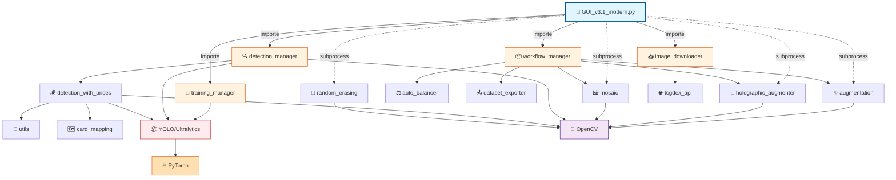
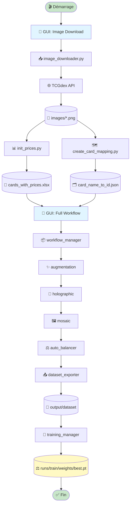
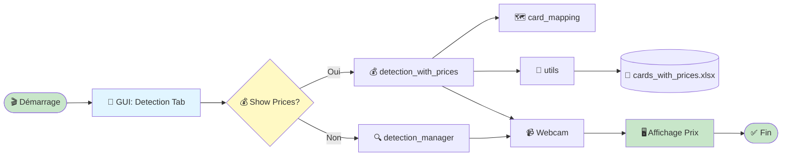
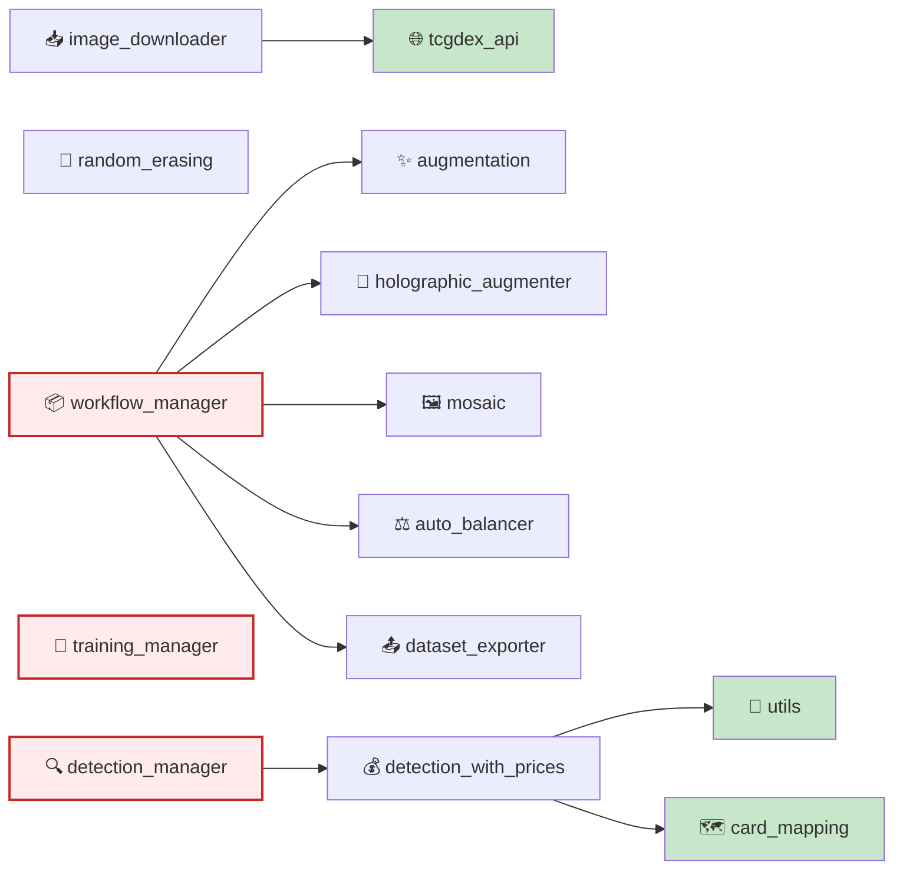

# 📊 Graphe de Dépendances - Diagramme Interactif

## Vue d'ensemble

Ce fichier contient des diagrammes Mermaid visualisant les relations entre les composants du projet.

---

## 🎨 Architecture Complète



---

## 🔄 Workflow Complet - Téléchargement → Entraînement



---

## 🔍 Workflow Détection avec Prix



---

## 🧪 Architecture des Tests

```mermaid
graph TB
    %% Lanceurs de tests
    RAT[🎯 run_all_tests.bat]
    RT[🔧 run_test.bat]
    
    %% Scripts Reference
    SR[📚 SCRIPTS_REFERENCE.py]
    
    %% Tests par catégorie
    subgraph Hardware
        TC[test_cuda]
    end
    
    subgraph Integration
        TPI[test_project_integrity]
        TWS[test_workflow_simulation]
        TFC[test_full_chain]
    end
    
    subgraph Features
        TDP[test_detection_prices]
    end
    
    subgraph Training
        TGT[test_gpu_training]
    end
    
    subgraph Performance
        TAP[test_autobalancer_performance]
        THP[test_holographic_performance]
        TMP[test_mosaic_performance]
    end
    
    subgraph Validation
        VDY[verify_data_yaml]
        VD[verify_detailed]
        CCI[check_corrupted_images]
        TA[test_annotations]
    end
    
    subgraph Visualization
        VA[visualize_annotations]
        VB[visualize_bbox]
    end
    
    subgraph Debug
        TMD[test_mapping_debug]
    end
    
    %% Connexions
    RAT --> SR
    RT --> SR
    
    SR --> TC
    SR --> TPI
    SR --> TWS
    SR --> TDP
    SR --> TFC
    SR --> TGT
    SR --> TAP
    SR --> THP
    SR --> TMP
    SR --> TMD
    SR --> VDY
    SR --> VD
    SR --> CCI
    SR --> TA
    SR --> VA
    SR --> VB
    
    style RAT fill:#e1f5ff
    style RT fill:#e1f5ff
    style SR fill:#fff3e0,stroke:#e65100,stroke-width:2px
```



---

## 📦 Modules Core - Interdépendances



---

## 🎯 Scripts Principaux - Appels

```mermaid
graph TB
    %% Scripts d'entrée
    UINIT[👤 Utilisateur]
    
    %% Scripts système
    RS[🔧 run_script.bat]
    RG[🎨 run_gui_v3.1.bat]
    PD[📦 Pokemon_Dataset_Generator.bat]
    
    %% Scripts Python
    IP[📊 init_prices]
    IPR[📊 init_prices_real]
    IPS[📊 init_prices_simple]
    
    CCM[🗺️ create_card_mapping]
    CRM[🗺️ create_real_mapping]
    REM[📖 read_excel_mapping]
    
    FCM[🔧 fix_class_mapping]
    FCMC[🔧 fix_class_mapping_correct]
    DEK[🐛 debug_excel_keys]
    
    WO[🔄 workflow_optimized]
    MD[🔗 merge_dataset]
    
    CYL[🏷️ create_yolo_labels_test]
    
    %% GUI et modules
    GUI[🎨 GUI_v3.1_modern]
    
    %% Connexions
    UINIT --> RS
    UINIT --> RG
    UINIT --> PD
    UINIT --> IP
    UINIT --> IPR
    UINIT --> IPS
    UINIT --> CCM
    UINIT --> CRM
    UINIT --> REM
    UINIT --> FCM
    UINIT --> FCMC
    UINIT --> DEK
    UINIT --> MD
    UINIT --> CYL
    
    RS --> WO
    RG --> GUI
    PD --> GUI
    
    style UINIT fill:#f3e5f5,stroke:#4a148c,stroke-width:2px
    style RS fill:#e1f5ff
    style RG fill:#e1f5ff
    style PD fill:#e1f5ff
    style GUI fill:#fff3e0,stroke:#e65100,stroke-width:2px
```



---

## 🔗 Dépendances Externes

```mermaid
graph TB
    %% Packages externes
    UV[📦 ultralytics]
    CV2[🎥 opencv-python]
    TORCH[🔥 torch]
    PD[📊 pandas]
    REQ[🌐 requests]
    YAML[📄 PyYAML]
    TK[🖼️ tkinter]
    OPX[📑 openpyxl]
    NP[🔢 numpy]
    PIL[🖼️ Pillow]
    
    %% Modules internes qui les utilisent
    subgraph Detection/Training
        TM[training_manager]
        DM[detection_manager]
        DWP[detection_with_prices]
    end
    
    subgraph Traitement Image
        AUG[augmentation]
        HOLO[holographic_augmenter]
        MOS[mosaic]
        RE[random_erasing]
    end
    
    subgraph Data/API
        UTILS[utils]
        ID[image_downloader]
        API[tcgdex_api]
    end
    
    subgraph Interface
        GUI[GUI_v3.1_modern]
    end
    
    %% Connexions
    UV --> TM
    UV --> DM
    UV --> DWP
    
    TORCH --> UV
    
    CV2 --> AUG
    CV2 --> HOLO
    CV2 --> MOS
    CV2 --> RE
    CV2 --> DM
    CV2 --> DWP
    
    PD --> UTILS
    PD --> DWP
    
    REQ --> ID
    REQ --> API
    
    YAML --> UTILS
    
    TK --> GUI
    
    OPX --> UTILS
    OPX --> PD
    
    NP --> AUG
    NP --> HOLO
    
    PIL --> UTILS
    
    style UV fill:#ffebee,stroke:#c62828,stroke-width:2px
    style TORCH fill:#ffe0b2,stroke:#e65100,stroke-width:2px
    style CV2 fill:#f3e5f5,stroke:#4a148c,stroke-width:2px
    style TK fill:#e1f5ff,stroke:#01579b,stroke-width:2px
```



---

## 📝 Comment utiliser ces diagrammes ?

### Sur GitHub / GitLab
Les diagrammes Mermaid s'affichent automatiquement dans les Markdown.

### Dans VS Code
Installez l'extension **Markdown Preview Mermaid Support** :
```
code --install-extension bierner.markdown-mermaid
```

### En ligne
Copiez-collez le code Mermaid dans :
- https://mermaid.live/
- https://mermaid-js.github.io/mermaid-live-editor/

### Générer des images
Utilisez l'outil CLI Mermaid :
```bash
npm install -g @mermaid-js/mermaid-cli
mmdc -i DEPENDENCY_GRAPH.md -o dependency_graph.png
```

---

## 🎯 Légende

| Symbole | Signification |
|---------|---------------|
| → | Import direct |
| -.-> | Appel subprocess |
| {} | Décision |
| [()] | Fichier/Données |
| ([]) | Début/Fin |
| 🎨 | Interface GUI |
| 📦 | Manager/Package |
| 🔍 | Détection |
| ✨ | Augmentation |
| 🧪 | Test |
| 🔧 | Utilitaire |
| 🌐 | API externe |
| 📄 | Fichier de données |

---

**Dernière mise à jour** : 2025-11-10  
**Maintenu par** : Projet Pokémon Dataset Generator  
**Version** : 1.0
