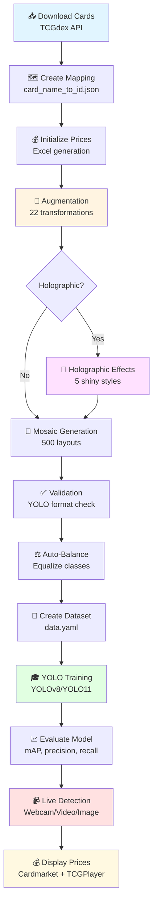

<div align="center">


# 🎮 Pokémon Dataset Generator v3.1

[](https://www.python.org/downloads/)
[](https://opensource.org/licenses/MIT)
[](https://opencv.org/)
[](https://ultralytics.com/)

**Complete YOLO pipeline with modern GUI: Dataset generation → Training → Live detection with prices**

*Centralized script system • Tests in venv • Advanced augmentation • Card mapping • Price detection • Annotated mosaics • YOLOv8 training • Multi-format export • TCGdex API*

---

[📖 Documentation](README.md) • [📜 Changelog](CHANGELOG.md) • [🚀 Features](FEATURES.md) • [🛠️ Maintenance](MAINTENANCE_SCRIPTS_REFERENCE.md)

</div>

---

## 📋 Table of Contents

1. [🖼️ Screenshots & Examples](#️-screenshots--examples)
2. [🚀 Quick Start](#-quick-start)
3. [📁 Project Structure](#-project-structure)
4. [✨ Main Features](#-main-features)
5. [🎨 GUI v3.1 Interface](#-gui-v31-interface)
6. [🔄 Complete Workflow](#-complete-workflow)
7. [🧪 Centralized Script System](#-centralized-script-system)
8. [📦 Configuration & Dependencies](#-configuration--dependencies)
9. [🎓 YOLO Training](#-yolo-training)
10. [💰 Price System & Detection](#-price-system--detection)
11. [📚 Complete Documentation](#-complete-documentation)
12. [🐛 Troubleshooting](#-troubleshooting)
13. [🤝 Contributing](#-contributing)

---

## 🖼️ Screenshots & Examples

<div align="center">

### Modern GUI Interface v3.1

<table>
<tr>
<td align="center" width="50%">


**Dashboard (Home)**  
Real-time statistics, environment checks, quick actions
</td>
<td align="center" width="50%">


**Settings Dialog**  
6 configuration tabs with live preview
</td>
</tr>
</table>

---

### Image Processing Pipeline

<table>
<tr>
<td align="center" width="33%">


**Original Card**  
Source image from TCGdex API
</td>
<td align="center" width="33%">


**Augmented Cards**  
22 transformation types
</td>
<td align="center" width="33%">


**Holographic Effect**  
5 shiny styles (rainbow, metallic, glitter)
</td>
</tr>
</table>

---

### Mosaic Generation & Annotations


**Annotated Mosaic - YOLO Format Ready**  
Complete dataset with bounding boxes and 4-point polygons

---

### Training & Detection

<table>
<tr>
<td align="center" width="50%">


**Training Dashboard**  
Real-time metrics: mAP, precision, recall, loss curves
</td>
<td align="center" width="50%">


**Live Detection with Prices**  
Real-time card detection with Cardmarket pricing
</td>
</tr>
</table>

---

### Price System Integration


**Excel Price Database**  
Auto-generated from TCGdex API with Cardmarket + TCGPlayer prices

</div>

---

## 🚀 Quick Start

### Installation (First Time)

**Prerequisites**:
- Windows 10/11
- Python 3.12 (recommended) or 3.10/3.11
- 4GB+ RAM
- NVIDIA GPU (optional, for training)

**Installation in 2 steps**:

```batch
# 1️⃣ Install virtual environment and dependencies
INSTALL.bat

# 2️⃣ Launch the application
START.bat
```

**That's it!** The modern GUI opens automatically.

### What does INSTALL.bat do?

1. ✅ Detects Python 3.12/3.11/3.10 (avoids 3.13+ for NumPy compatibility)
2. ✅ Creates virtual environment `.venv`
3. ✅ Installs all dependencies from `config/requirements.txt`
4. ✅ Configures NumPy < 2.0 for imgaug compatibility
5. ✅ Verifies package versions

### What does START.bat do?

1. ✅ Checks that `.venv` exists
2. ✅ Activates virtual environment
3. ✅ Runs `pip check` to verify compatibility
4. ✅ Launches `GUI_v3.1_modern.py`
5. ✅ Handles errors and displays error codes

### Daily Usage

```batch
# Launch the application
START.bat

# That's all! No need to reinstall
```

---

## 📁 Project Structure

### 🏗️ Modern & Clean Organization

```
pok/
├── 📱 START.bat                    # Main application launcher
├── 📦 INSTALL.bat                  # Environment installer
├── 📖 README.md                    # Quick start guide
├── 🎨 GUI_v3.1_modern.py          # Main GUI application
├── 🔒 .gitignore                   # Files ignored by Git
│
├── 🧪 .venv/                       # Python virtual environment (created by INSTALL.bat)
│
├── ⚙️ config/                      # 📂 Configuration & requirements
│   ├── requirements.txt            # Main dependencies
│   ├── requirements_training.txt   # Training dependencies (optional)
│   ├── requirements_extra.txt      # Extra dependencies
│   ├── api_config.json.example     # TCGdex API config template
│   ├── gui_config.json             # GUI configuration (auto-generated)
│   └── pokemon_dataset_generator.spec  # PyInstaller spec
│
├── 🤖 models/                      # 📂 YOLO models & mappings
│   ├── yolo11n.pt                  # YOLO11 nano model
│   ├── yolov8n.pt                  # YOLOv8 nano model
│   └── card_name_to_id.json        # Class name → TCGdex ID mapping
│
├── 📚 docs/                        # 📂 Complete documentation
│   ├── README.md                   # Documentation index
│   ├── README_COMPLET.md          # Detailed documentation (French)
│   ├── README_COMPLET_V2.md       # This file - Complete guide (English)
│   ├── CHANGELOG.md               # Version history
│   ├── HELP.md                    # Complete user guide
│   ├── FEATURES.md                # Feature list
│   ├── README_SCRIPTS_SYSTEM.md   # Centralized script system
│   ├── DEPENDENCIES_MAP.md        # Dependency mapping
│   ├── DEPENDENCY_GRAPH.md        # Interactive diagrams (Mermaid)
│   ├── MAINTENANCE_SCRIPTS_REFERENCE.md  # Maintenance guide
│   ├── MEMO_VENV_USAGE.md         # Venv usage memo
│   ├── CHECKLIST_MODIFICATIONS.md # Modification checklist
│   └── ... (other docs)
│
├── 🔧 scripts/                     # 📂 Utility scripts & tests
│   ├── SCRIPTS_REFERENCE.py       # 🔥 CENTRALIZED CATALOG (system key)
│   ├── install_env.bat            # Installation script (called by INSTALL.bat)
│   ├── run_all_tests.bat          # Run all tests
│   ├── run_test.bat              # Run specific test
│   ├── run_script.bat            # Run specific script
│   ├── init_prices.py            # Initialize prices from data.yaml
│   ├── create_card_mapping.py    # Create card mapping
│   ├── workflow_optimized.py     # Optimized CLI workflow
│   └── ... (14 cataloged scripts)
│
├── 🧪 tests/                       # 📂 Automated tests (16 tests)
│   ├── test_project_integrity.py  # Project integrity test
│   ├── test_cuda.py               # CUDA/GPU test
│   ├── test_detection_prices.py   # Detection with prices test
│   ├── test_workflow_simulation.py # Complete workflow simulation
│   └── ... (other tests)
│
├── 💻 core/                        # 📂 Main Python modules
│   ├── __init__.py
│   ├── augmentation.py            # Augmentation engine
│   ├── mosaic.py                  # Mosaic generator
│   ├── detection_with_prices.py   # Detection with prices
│   ├── card_mapping.py            # Mapping system
│   ├── tcgdex_api.py              # TCGdex API client
│   ├── image_downloader.py        # Image downloader
│   ├── training_manager.py        # Training manager
│   ├── detection_manager.py       # Detection manager
│   ├── workflow_manager.py        # Workflow orchestrator
│   ├── holographic_augmenter.py   # Holographic effects
│   ├── auto_balancer.py           # Auto-balancing
│   ├── dataset_validator.py       # Dataset validator
│   ├── dataset_exporter.py        # Multi-format exporter
│   ├── random_erasing.py          # Random erasing
│   └── utils.py                   # Common utilities
│
├── 🖼️ images/                      # Downloaded source images
├── 🎨 augmented/                   # Generated augmented images
├── 📊 output/                      # Generated YOLO datasets
│   ├── augmented/                 # Augmentations + labels
│   ├── yolov8/                    # Final YOLO dataset
│   ├── holographic/               # Holographic effects
│   └── mosaics/                   # Annotated mosaics
├── 🏃 runs/                        # YOLO training results
│   └── train/                     # Training folders
│       └── pokemon_detector/
│           └── weights/
│               ├── best.pt        # Best model
│               └── last.pt        # Last checkpoint
├── 📈 excel/                       # Excel price files
│   └── cards_with_prices.xlsx    # Card prices (auto-generated)
│
├── 🌄 backgrounds/                 # Backgrounds for mosaics
│   ├── original/
│   └── augmented/
├── 📦 bbox_visualization/          # Bounding box visualizations
├── 🗂️ dataset_voc/                 # Pascal VOC format dataset
├── 🌐 examples/                    # Example images for README
├── 🗑️ obsolete/                    # Obsolete files (do not use)
└── 🛠️ tools/                       # Misc tools (deprecated)
```

### 🔑 Key Files to Know

| File | Role | Modification |
|------|------|--------------|
| **START.bat** | Launch application | ❌ Do not modify |
| **INSTALL.bat** | Install environment | ❌ Do not modify |
| **config/requirements.txt** | Python dependencies | ⚠️ Add packages here |
| **models/card_name_to_id.json** | Card mapping | ✅ Generated by `scripts/create_card_mapping.py` |
| **scripts/SCRIPTS_REFERENCE.py** | Scripts/tests catalog | ⚠️ Update if adding script/test |
| **.github/copilot-instructions.md** | AI instructions | ⚠️ Project structure rules |

---

## ✨ Main Features

### 🎨 Modern GUI v3.1 Interface

<table>
<tr>
<td width="50%" valign="top">

#### 📊 Dashboard (Home)
- Real-time statistics
- Counters: source images, augmented, mosaics
- Dataset size calculation
- Environment verification
- Quick action buttons
- Visual charts (if matplotlib available)

#### 📥 Image Download
- **Free TCGdex API** (no auth)
- **200+ Pokemon sets** available
- **10 languages**: EN, FR, ES, DE, IT, PT, JA, KO, ZH, TH
- **HD/Low quality** and PNG/JPG/WebP formats
- **Parallel download** (1-16 workers)
- **CSV manifest** auto-generated

#### 🎨 Advanced Augmentation
- **22 transformation types**:
  - Visual: Blur, Contrast, Saturation, Fog, Posterize, Sharpen, Emboss
  - Noise: Gaussian, Salt & Pepper, JPEG compression
  - Geometry: Rotation, Scale, Translation, Perspective
  - Color: HSV shift, Channel shuffle, Color temperature
  - Advanced: Random erasing, Elastic deform, Grid distortion
- **Holographic effects**: 5 styles (rainbow, linear, radial, metallic, glitter)
- **Auto YOLO annotations**: Generates .txt for each image
- **Unique counter**: 1-100 augmentations per image

</td>
<td width="50%" valign="top">

#### 🧩 Mosaic Generator
- **3 generation modes**:
  - Quick (200): Fast testing
  - Standard (500): Recommended
  - Complete (All): Unlimited - full dataset
- **3 layouts**: Grid, 3D Rotation, Random
- **3 backgrounds**: Fake Cards, Local, Web
- **2 transforms**: 2D Rotation, 3D Perspective
- **Ultra-fast generation**: ProcessPoolExecutor (30-60x faster)
- **Prefix system**: Prevents file overwriting (L{layout}_B{bg}_T{transform}_)
- **Robust error handling**: Corrupted images auto-moved to `corrupted/`
- **Polygon annotations** (4 points)
- **YOLOv8 compatible**
- **📂 Quick folder access** from GUI

#### 🎓 YOLO Training
- **5 model sizes**: n, s, m, l, x
- **YOLOv8 and YOLO11** supported
- **Real-time logs** with colors
- **Auto metrics**: mAP, precision, recall
- **Stop button** for interruption
- **GPU auto-detected**

#### 📹 Live Detection
- **3 modes**: Webcam, Video, Image
- **Price display** in real-time
- **Bounding boxes** with confidence
- **Recording** of detections
- **Batch processing** of images

#### ⚖️ Auto-Balancer
- **Automatic balancing** of classes
- **3 strategies**: Augment, Reduce, Both
- **Configurable target count**
- **Auto backup** before modification

</td>
</tr>
</table>

### 💰 Price System & Detection

- ✅ **Automatic mapping**: YOLO class ↔ TCGdex ID
- ✅ **Real-time prices**: Cardmarket + TCGPlayer
- ✅ **Integrated Excel**: Auto-generation and update
- ✅ **Visual overlay**: Display on detections
- ✅ **TCGdex API**: Free, multilingual, no auth

---

## 🎨 GUI v3.1 Interface

### 📱 Navigation & Layout

**9 main tabs organized by workflow**:

1. **🏠 Dashboard** - Statistics & quick actions
2. **📥 Image Download** - TCGdex API integration
3. **🎨 Augmentation** - 22 transformation types
4. **🌈 Holographic** - 5 shiny effects
5. **🧩 Mosaics** - Annotated layout generation
6. **✅ Validation** - YOLO format verification
7. **🎓 Training** - YOLOv8/YOLO11 training
8. **📹 Detection** - Live detection with prices
9. **🔄 Workflow** - Complete automated pipeline

**Additional features**:
- ⚙️ **Settings dialog** (6 configuration tabs)
- 🛠️ **Tools menu** (clean, export, utilities)
- 📊 **Real-time logs** with color coding
- ✋ **Stop button** for all operations
- 🌙 **Dark/Light mode** toggle

### 🎯 Key GUI Features

**Dashboard Statistics**:
```
Source Images:     252 PNG files
Augmented:        1,260 images (x5)
Mosaics:           500 layouts
Dataset Size:      2.4 GB
Environment:       ✅ .venv active
```

**Environment Checks**:
- ✅ Virtual environment exists
- ✅ Dependencies installed
- ✅ Excel file present
- ⚠️ Fix Now button if issues

**Progress Tracking**:
- Blue animated progress bars
- Step-by-step status updates
- Elapsed time counter
- Success/Error messages with emojis

---

## 🔄 Complete Workflow

### 📊 Visual Workflow Diagram



### 🚀 Detailed Workflow Steps

#### Step 1: Download Cards 📥

**Via GUI**:
1. Open **Image Download** tab
2. Select set (e.g., "Surging Sparks" or "sv08")
3. Choose language and quality
4. Click **Download**

**Via CLI**:
```batch
call .venv\Scripts\activate.bat
python core/image_downloader.py --set "Surging Sparks" --lang en --quality high
```

**Output**: 
- Images in `images/`
- Manifest CSV with metadata

---

#### Step 2: Create Card Mapping 🗺️

**Purpose**: Map YOLO class names ↔ TCGdex IDs

**Command**:
```batch
scripts\run_script.bat create_card_mapping
```

**Output**: `models/card_name_to_id.json`

**Example**:
```json
{
  "Ho-Oh": "sv08_019",
  "Quaxly": "sv08_051",
  "Iron_Crown": "sv08_132"
}
```

---

#### Step 3: Initialize Prices 💰

**3 methods**:

**A) From data.yaml** (after dataset creation):
```batch
scripts\run_script.bat init_prices
```

**B) Test set** (8 cards):
```batch
scripts\run_script.bat init_prices_simple
```

**C) Real set** (predefined):
```batch
scripts\run_script.bat init_prices_real
```

**Output**: `excel/cards_with_prices.xlsx`

**Columns**:
- Name, Set #, Type, Rarity
- Prix (avg), Prix max
- SourcePrix (Cardmarket/TCGPlayer)

---

#### Step 4: Augmentation 🎨

**Via GUI**:
1. **Augmentation** tab
2. Set count (e.g., 50)
3. Choose type: Standard / Holographic / Both
4. Click **START AUGMENTATION**

**Via CLI**:
```batch
call .venv\Scripts\activate.bat
python core/augmentation.py --input images/ --output augmented/ --count 50
```

**Output**:
- Augmented images in `augmented/images/`
- YOLO labels in `augmented/labels/`

**22 Transformation Types Applied**:
- 2-5 simultaneous random transforms per image
- 35,420+ unique combinations possible
- PNG alpha channel preserved

---

#### Step 5: Holographic Effects 🌈 (Optional)

**5 Shiny Styles**:
1. **Rainbow**: Multi-color gradient overlay
2. **Linear**: Horizontal/vertical shimmer
3. **Radial**: Circular light burst
4. **Metallic**: Chrome-like reflection
5. **Glitter**: Sparkle patterns

**Via GUI**:
1. **Holographic** tab
2. Set intensity (0.1-1.0)
3. Set variations (1-10)
4. Click **GENERATE**

**Via CLI**:
```batch
python core/holographic_augmenter.py --intensity 0.7 --variations 3
```

---

#### Step 6: Mosaic Generation 🧩

**3 Generation Modes**:
- **Quick (200)**: 25 groups × 8 cards ≈ 200 mosaics (fast testing)
- **Standard (500)**: 62 groups × 8 cards ≈ 500 mosaics (recommended)
- **Complete (All)**: Unlimited - generates all possible mosaics from available images

**Performance Optimizations**:
- ⚡ **ProcessPoolExecutor**: True parallel processing (30-60x faster than sequential)
- 🚀 **PNG compression = 0**: Ultra-fast writing without compression
- 🛡️ **Corrupted image handling**: Auto-moves bad images to `corrupted/` folder
- 📂 **Prefix system**: `L{layout}_B{background}_T{transform}_` prevents file overwriting

**Via GUI**:
1. **Mosaics** tab
2. Select mode (Quick/Standard/Complete)
3. Choose layout (Grid/3D Rotation/Random)
4. Choose background (Fake Cards/Local/Web)
5. Click **🧩 GENERATE MOSAICS**
6. Click **📂 Open Folder** to view results

**Via CLI**:
```batch
python core/mosaic_optimized.py 1 0 0  # Layout 1, Background 0, Transform 0
python core/mosaic_optimized.py 1 0 0 --max-groups 500  # Limit to 500 groups
```

**Output**:
- Mosaics in `output/mosaics/images/` with prefix (e.g., `L1_B0_T0_layout_001.png`)
- Annotations in `output/mosaics/labels/` (4-point polygons)
- Corrupted images moved to `corrupted/` if any

---

#### Step 7: Validation ✅

**What it checks**:
1. YOLO format correctness
2. Image integrity (no corruption)
3. Label matching (every image has label)
4. Class distribution
5. Bounding box validity (coordinates in [0, 1])

**Via GUI**:
1. **Validation** tab
2. Click **VALIDATE DATASET**
3. View HTML report

**Via CLI**:
```batch
scripts\run_test.bat verify_data_yaml
```

**Output**: `validation_report.html` (auto-opens in browser)

---

#### Step 8: Auto-Balance ⚖️

**Purpose**: Equalize class distribution

**3 Strategies**:
- **Augment**: Increase minority classes
- **Reduce**: Decrease majority classes
- **Both**: Equalize all classes to target count

**Via GUI**:
1. **Workflow** tab → **Auto-Balance** section
2. Set target count (e.g., 50)
3. Select strategy
4. Click **BALANCE**

**Via CLI**:
```batch
call .venv\Scripts\activate.bat
python core/auto_balancer.py --target 50 --strategy augment
```

---

#### Step 9: YOLO Training 🎓

**5 Model Sizes**:

| Model | Speed | Accuracy | VRAM | Use Case |
|-------|-------|----------|------|----------|
| **n** | ⚡⚡⚡ | ⭐⭐ | ~2GB | Mobile, real-time |
| **s** | ⚡⚡ | ⭐⭐⭐ | ~4GB | Balanced (recommended) |
| **m** | ⚡ | ⭐⭐⭐⭐ | ~6GB | High accuracy |
| **l** | 🐌 | ⭐⭐⭐⭐⭐ | ~8GB | Maximum accuracy |
| **x** | 🐢 | ⭐⭐⭐⭐⭐ | ~12GB | Research |

**Via GUI**:
1. **Training** tab
2. Select model size (e.g., `n`)
3. Set epochs (50-100)
4. Set batch size (auto or manual)
5. Set image size (640 standard)
6. Click **START TRAINING**

**Via CLI**:
```batch
call .venv\Scripts\activate.bat
python core/training_manager.py --data output/yolov8/data.yaml --epochs 50 --model yolov8n
```

**Output**:
- Best model: `runs/train/pokemon_detector/weights/best.pt`
- Last checkpoint: `runs/train/pokemon_detector/weights/last.pt`
- Metrics: `results.png`, `confusion_matrix.png`
- Validation predictions: `val_batch0_pred.jpg`

**Training Metrics Displayed**:
- **mAP@50**: Mean Average Precision at 50% IoU
- **mAP@50-95**: Mean Average Precision at 50-95% IoU
- **Precision**: TP / (TP + FP)
- **Recall**: TP / (TP + FN)
- **Loss**: Box loss, Class loss, DFL loss

---

#### Step 10: Live Detection 📹

**3 Detection Modes**:
1. **Webcam**: Real-time camera detection
2. **Video**: Process video file
3. **Image**: Batch process images

**Via GUI**:
1. **Detection** tab
2. Load trained model (`best.pt`)
3. ✅ Check **Show Prices**
4. Select source (Webcam 0 / Video file / Image folder)
5. Set confidence threshold (0.5 default)
6. Click **START DETECTION**

**Via CLI**:
```batch
python core/detection_with_prices.py --source 0 --model runs/train/pokemon_detector/weights/best.pt
```

**Display**:
- Green bounding boxes
- Card name (class)
- Confidence (e.g., 95%)
- Price (e.g., "12.50 EUR") if **Show Prices** enabled

---

### ⚡ Quick Workflow (Automated)

**All-in-one command** (GUI):
1. **Workflow** tab
2. Configure steps (checkboxes)
3. Click **START WORKFLOW**

**All-in-one command** (CLI):
```batch
scripts\run_script.bat workflow_optimized
```

**Automated Steps**:
1. ✅ Augmentation (if enabled)
2. ✅ Holographic (if enabled)
3. ✅ Mosaic generation
4. ✅ Validation
5. ✅ Auto-balance
6. ✅ Training (if enabled)

**Duration**: ~1-2 hours for 252 cards (depends on GPU)

---

## 🧪 Centralized Script System

### 🎯 Principle: One Unique Catalog

All scripts and tests are cataloged in **`scripts/SCRIPTS_REFERENCE.py`**.

**Advantages**:
- ✅ Central catalog of 14 scripts + 16 tests
- ✅ Guaranteed venv usage
- ✅ Integrated documentation (dependencies, category)
- ✅ Simplified execution via .bat files
- ✅ Traceability with CHANGELOG

### 📋 Available Scripts (14)

**Configuration**:
- `init_prices`: Initialize prices from data.yaml
- `init_prices_real`: Initialize prices from TCGdex API
- `init_prices_simple`: Simplified version (8 cards)

**Data Processing**:
- `create_card_mapping`: Create class ↔ TCGdex ID mapping
- `create_real_mapping`: Real mapping
- `merge_dataset`: Merge multiple datasets

**Debug**:
- `debug_excel_keys`: Debug Excel keys
- `fix_class_mapping`: Fix mapping

**Workflow**:
- `workflow_optimized`: Complete optimized workflow

### 🧪 Available Tests (16)

**Hardware**:
- `test_cuda`: Test CUDA/GPU

**Integration**:
- `test_project_integrity`: Complete integrity
- `test_workflow_simulation`: Workflow simulation
- `test_full_chain`: Complete chain

**Performance**:
- `test_mosaic_performance`: Mosaic benchmark
- `test_holographic_performance`: Holographic benchmark
- `test_autobalancer_performance`: Auto-balancer benchmark

**Validation**:
- `verify_data_yaml`: Verify data.yaml
- `check_corrupted_images`: Check images
- `verify_detailed`: Detailed verification

### ⚠️ ABSOLUTE RULE: Tests in venv only

**✅ CORRECT**:
```batch
# Method 1 (recommended): Use .bat files
scripts\run_test.bat test_cuda
scripts\run_script.bat init_prices

# Method 2: Activate venv then execute
call .venv\Scripts\activate.bat
python tests\test_cuda.py
```

**❌ INCORRECT**:
```batch
# NEVER execute directly without venv
python tests\test_cuda.py          # ❌ Wrong environment
python scripts\init_prices.py      # ❌ Missing dependencies
```

**Why**:
- Guarantees NumPy < 2.0 (required for imgaug)
- Avoids package conflicts
- Ensures reproducibility
- Consistent versions

### 🚀 Essential Commands

```batch
# List all scripts
python scripts\SCRIPTS_REFERENCE.py --list

# List all tests
python scripts\SCRIPTS_REFERENCE.py --list-tests

# Run a script
scripts\run_script.bat init_prices

# Run a test
scripts\run_test.bat test_cuda

# Run all tests
scripts\run_all_tests.bat

# Check venv
python scripts\SCRIPTS_REFERENCE.py --check-venv
```

---

## 📦 Configuration & Dependencies

### 📂 Configuration Files

**In `config/`**:

| File | Description | Modification |
|------|-------------|--------------|
| **requirements.txt** | Main dependencies | ⚠️ Add packages here |
| **requirements_training.txt** | PyTorch + Ultralytics (GPU) | ℹ️ Optional |
| **requirements_extra.txt** | Flask API, SQLAlchemy | ℹ️ Optional |
| **api_config.json.example** | API config template | ✅ Copy to api_config.json |
| **gui_config.json** | GUI config (auto) | ❌ Auto-generated |

### 🔧 Main Dependencies

**Core (requirements.txt)**:
```python
numpy<2.0                # Pinned for imgaug
opencv-python<4.10.0     # Compatible NumPy 1.x
pandas                   # Excel manipulation
openpyxl                 # Excel read/write
imgaug>=0.4.0            # Advanced augmentation
pillow                   # Images
requests                 # API calls
scipy<1.14               # Scientific computing
scikit-image<0.23        # Image processing
imagecorruptions         # Corruptions for augmentation
```

**Training (requirements_training.txt)**:
```python
# Install PyTorch with appropriate CUDA:
# RTX 40xx/50xx: pip install torch torchvision --index-url https://download.pytorch.org/whl/cu124
# RTX 30xx: pip install torch torchvision --index-url https://download.pytorch.org/whl/cu118

ultralytics>=8.0.0       # YOLOv8/YOLO11
```

### 🎨 GUI Configuration

The file `config/gui_config.json` is auto-generated and saves:
- Default paths (images/, output/, etc.)
- Augmentation parameters
- Mosaic preferences
- Last training parameters
- Detection thresholds

**Do not modify manually**, use GUI interface → ⚙️ Settings.

---

## 🎓 YOLO Training

### 📊 Model Sizes

| Model | Speed | Accuracy | VRAM | Use Case |
|-------|-------|----------|------|----------|
| **YOLOv8n** | ⚡⚡⚡ | ⭐⭐ | ~2GB | Mobile, real-time |
| **YOLOv8s** | ⚡⚡ | ⭐⭐⭐ | ~4GB | Balanced (recommended) |
| **YOLOv8m** | ⚡ | ⭐⭐⭐⭐ | ~6GB | High accuracy |
| **YOLOv8l** | 🐌 | ⭐⭐⭐⭐⭐ | ~8GB | Maximum accuracy |
| **YOLOv8x** | 🐢 | ⭐⭐⭐⭐⭐ | ~12GB | Research |

### 🚀 Via GUI

1. **Training** tab in GUI
2. Select model (n/s/m/l/x)
3. Configure epochs (50-100)
4. Configure batch size (auto or manual)
5. Choose image size (640 standard)
6. Click **START TRAINING**

**Output**: `runs/train/pokemon_detector/weights/best.pt`

### 💻 Via CLI

```batch
# Complete workflow (download → augment → mosaic → train)
scripts\run_script.bat workflow_optimized

# Or use Python directly (in venv)
call .venv\Scripts\activate.bat
python core/training_manager.py --data output/yolov8/data.yaml --epochs 50 --model yolov8n
```

### 📈 Training Metrics

**Generated files**:
- `runs/train/pokemon_detector/weights/best.pt`: Best model
- `runs/train/pokemon_detector/weights/last.pt`: Last checkpoint
- `runs/train/pokemon_detector/results.png`: Metric curves
- `runs/train/pokemon_detector/confusion_matrix.png`: Confusion matrix
- `runs/train/pokemon_detector/val_batch0_pred.jpg`: Validation predictions

**Displayed metrics**:
- **mAP@50**: Mean Average Precision at 50% IoU
- **mAP@50-95**: Mean Average Precision at 50-95% IoU
- **Precision**: TP / (TP + FP)
- **Recall**: TP / (TP + FN)
- **Loss**: Box, Cls, DFL

---

## 💰 Price System & Detection

### 🗺️ Card Mapping System

**File**: `models/card_name_to_id.json`

**Format**:
```json
{
  "Ho-Oh": "sv08_019",
  "Castform_Sunny_Form": "sv08_020",
  "Quaxly": "sv08_051"
}
```

**Generation**:
```batch
scripts\run_script.bat create_card_mapping
```

### 💵 Price Initialization

**Method 1: From data.yaml** (after dataset creation)
```batch
scripts\run_script.bat init_prices
```

**Method 2: Test set** (8 cards)
```batch
scripts\run_script.bat init_prices_simple
```

**Method 3: Real set** (predefined)
```batch
scripts\run_script.bat init_prices_real
```

**Output**: `excel/cards_with_prices.xlsx`

**Columns**:
- Name: Card name
- Set #: Number in set
- Type: Card type
- Rarity: Rarity
- Prix: Average price (Cardmarket)
- Prix max: Maximum price
- SourcePrix: Source (Cardmarket/TCGPlayer)

### 📹 Detection with Prices

**Via GUI**:
1. **Detection** tab
2. Load model (`best.pt`)
3. ✅ Check **Show Prices**
4. Select source (Webcam/Video/Image)
5. Click **START DETECTION**

**Via CLI**:
```batch
call .venv\Scripts\activate.bat
python core/detection_with_prices.py --source 0 --model runs/train/pokemon_detector/weights/best.pt
```

**Display**:
- Green bounding box
- Card name
- Confidence (e.g., 95%)
- Price (e.g., "12.50 EUR")

---

## 📚 Complete Documentation

### 📖 Documentation Index

**In `docs/`**:

| File | Description | Audience |
|------|-------------|----------|
| **README.md** | Documentation index | All |
| **README_COMPLET.md** | Detailed documentation (French) | All |
| **README_COMPLET_V2.md** | This file - Complete guide (English) | All |
| **HELP.md** | Complete GUI user guide | Users |
| **CHANGELOG.md** | Version history | All |
| **FEATURES.md** | Detailed feature list | Users |
| **README_SCRIPTS_SYSTEM.md** | Centralized script system | Developers |
| **DEPENDENCIES_MAP.md** | Dependency mapping | Developers |
| **DEPENDENCY_GRAPH.md** | Interactive Mermaid diagrams | Developers |
| **MAINTENANCE_SCRIPTS_REFERENCE.md** | Maintenance guide | Maintainers |
| **MEMO_VENV_USAGE.md** | Venv quick memo | Developers |
| **CHECKLIST_MODIFICATIONS.md** | Modification checklist | Developers |

### 🔗 Quick Links

- **Installation problem?** → [HELP.md](HELP.md) Troubleshooting section
- **Add a script?** → [CHECKLIST_MODIFICATIONS.md](CHECKLIST_MODIFICATIONS.md)
- **Understand dependencies?** → [DEPENDENCIES_MAP.md](DEPENDENCIES_MAP.md)
- **Use venv?** → [MEMO_VENV_USAGE.md](MEMO_VENV_USAGE.md)
- **Complete workflow?** → [README_SCRIPTS_SYSTEM.md](README_SCRIPTS_SYSTEM.md)

---

## 🐛 Troubleshooting

### ❌ "Virtual environment not found"

**Problem**: `.venv` does not exist

**Solution**:
```batch
INSTALL.bat
```

### ❌ "No module named 'numpy'" or "ImportError"

**Problem**: Missing dependencies or venv not activated

**Solution**:
```batch
# Reinstall environment
rmdir /s /q .venv
INSTALL.bat
```

### ❌ "Unknown compiler(s)" during installation

**Problem**: Python 3.13+ used (no NumPy 1.x wheels)

**Solution**:
1. Install Python 3.12: https://www.python.org/downloads/release/python-3120/
2. Delete `.venv`
3. Re-run `INSTALL.bat`

### ❌ "pip check" shows conflicts

**Problem**: Incompatible package versions

**Solution**:
```batch
call .venv\Scripts\activate.bat
pip install --upgrade pip
pip install -r config/requirements.txt --force-reinstall
```

### ❌ GPU not detected

**Problem**: CPU PyTorch installed or CUDA missing

**Solution**:
```batch
call .venv\Scripts\activate.bat

# RTX 40xx/50xx (CUDA 12.4)
pip install torch torchvision --index-url https://download.pytorch.org/whl/cu124

# RTX 30xx (CUDA 11.8)
pip install torch torchvision --index-url https://download.pytorch.org/whl/cu118

# Verify
python -c "import torch; print(torch.cuda.is_available())"
```

### ❌ "Test failed" during run_all_tests.bat

**Problem**: Tests executed outside venv

**Solution**:
```batch
# Always use .bat files
scripts\run_all_tests.bat

# OR activate venv before
call .venv\Scripts\activate.bat
python tests\test_name.py
```

### ❌ Unicode/Encoding errors on Windows

**Problem**: Special characters in logs

**Solution**: Already fixed in v3.1 with:
- `safe_print()` in `core/utils.py`
- `PYTHONIOENCODING=utf-8` in START.bat
- Automatic ASCII fallback

### 📞 Need Help?

1. Check [HELP.md](HELP.md)
2. Review [CHANGELOG.md](CHANGELOG.md) for known bugs
3. Run diagnostic:
   ```batch
   scripts\run_test.bat test_project_integrity
   ```
4. Open issue: https://github.com/lo26lo/pok/issues

---

## 🤝 Contributing

### 🔧 Development Workflow

**IMPORTANT**: Read `.github/copilot-instructions.md` before any modification!

#### Add a Script

1. Create `scripts/my_script.py`
2. Update `scripts/SCRIPTS_REFERENCE.py`:
   - Add to `SCRIPTS_CATALOG`
   - Add line in `CHANGELOG`
3. Test: `scripts\run_script.bat my_script`
4. Commit together

#### Add a Test

1. Create `tests/test_name.py`
2. Update `scripts/SCRIPTS_REFERENCE.py`:
   - Add to `TESTS_CATALOG`
   - Update `CHANGELOG`
3. Test: `scripts\run_test.bat test_name`
4. Verify: `scripts\run_all_tests.bat`
5. Commit together

### 📋 Checklist Before Commit

- [ ] Venv activated for tests
- [ ] `SCRIPTS_REFERENCE.py` updated if adding script/test
- [ ] All tests pass (`scripts\run_all_tests.bat`)
- [ ] Clean root (only START.bat, INSTALL.bat, README.md)
- [ ] Files in correct folders (config/, models/, docs/, scripts/)
- [ ] Documentation updated if necessary

### 🚫 NEVER DO

- ❌ Create files at root (except START.bat, INSTALL.bat, README.md)
- ❌ Move files from config/, models/, docs/, scripts/ to root
- ❌ Run tests outside venv
- ❌ Forget to update `SCRIPTS_REFERENCE.py`
- ❌ Modify structure without confirmation

---

## 📄 License

MIT License - See [LICENSE](../LICENSE)

---

## 🙏 Credits

### Inspiration

Project inspired by:
- 📄 **[Real-Time Pokemon Card Detection from Tournament Footage](https://cs231n.stanford.edu/2024/papers/real-time-pokemon-card-detection-from-tournament-footage.pdf)** - Stanford CS231n (2024)

### Technologies

- 🔥 **[YOLOv8](https://github.com/ultralytics/ultralytics)** - Ultralytics
- 🎨 **[OpenCV](https://opencv.org/)** - Computer vision
- 🖼️ **[imgaug](https://github.com/aleju/imgaug)** - Advanced augmentation
- 🎴 **[TCGdex API](https://tcgdex.net/)** - TCG database
- 🐍 **[Python](https://www.python.org/)** - Main language

### Special Thanks

- Pokemon Company International for the amazing TCG
- Stanford CS231n course for computer vision research
- Open source community for incredible tools
- All contributors and users of this project

---

<div align="center">

**Made with ❤️ for Pokemon TCG collectors and AI enthusiasts**

⭐ Star this repo if you find it useful!

[🏠 Back to Top](#-pokémon-dataset-generator-v31)

</div>
